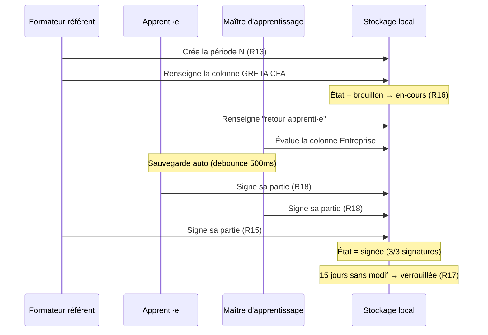
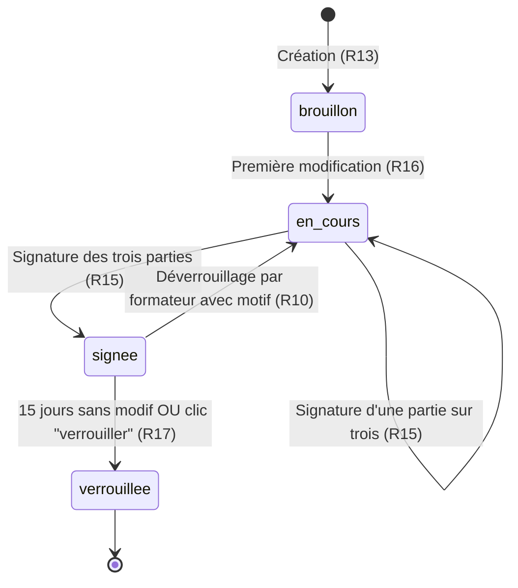
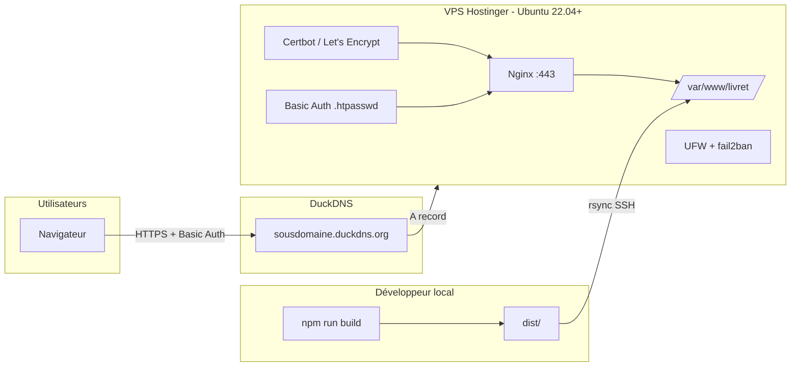

# Cahier des charges — Plateforme numérique de suivi d'apprentissage

**Projet** : Livret d'apprentissage numérique GRETA Lyon Métropole
**Version** : 1.3 — Étape 1 (maquette fonctionnelle complète, Skills, VPS, règles métier, responsive, seed data, conventions)
**Date** : avril 2026
**Pilote métier** : Guillaume (GRETA Lyon Métropole)
**Exécutant** : Claude Code (agent de développement)

---

## Table des matières

- [0. Mode d'emploi de ce document](#0-mode-demploi-de-ce-document)
- [1. Contexte](#1-contexte)
- [2. Objectifs de l'étape 1](#2-objectifs-de-létape-1)
- [3. Hors-périmètre explicite de l'étape 1](#3-hors-périmètre-explicite-de-létape-1)
- [4. Utilisateurs et rôles](#4-utilisateurs-et-rôles)
- [5. Périmètre fonctionnel de l'étape 1](#5-périmètre-fonctionnel-de-létape-1)
- [6. Matrice des droits par rôle](#6-matrice-des-droits-par-rôle)
- [7. Modèle de données](#7-modèle-de-données)
- [8. Règles métier et validations](#8-règles-métier-et-validations)
- [9. Gestion des erreurs et cas limites](#9-gestion-des-erreurs-et-cas-limites)
- [10. Navigation multi-livrets](#10-navigation-multi-livrets)
- [11. Responsive et cibles d'usage](#11-responsive-et-cibles-dusage)
- [12. Historique et traçabilité des modifications](#12-historique-et-traçabilité-des-modifications)
- [13. Stack technique recommandé](#13-stack-technique-recommandé)
- [14. Design system](#14-design-system)
- [15. Structure de fichiers proposée](#15-structure-de-fichiers-proposée)
- [16. Conventions de code et qualité](#16-conventions-de-code-et-qualité)
- [17. Internationalisation et terminologie](#17-internationalisation-et-terminologie)
- [18. Gestion des assets et identité visuelle](#18-gestion-des-assets-et-identité-visuelle)
- [19. Contraintes de performance](#19-contraintes-de-performance)
- [20. Confidentialité et absence de télémétrie](#20-confidentialité-et-absence-de-télémétrie)
- [21. Déploiement et hébergement](#21-déploiement-et-hébergement)
- [22. Skills Claude Code à mobiliser](#22-skills-claude-code-à-mobiliser)
- [23. Stratégie Git et workflow de revue](#23-stratégie-git-et-workflow-de-revue)
- [24. Seed data de démonstration](#24-seed-data-de-démonstration)
- [25. Scénario de démonstration (pilote d'exécution)](#25-scénario-de-démonstration-pilote-dexécution)
- [26. Jalons de réalisation](#26-jalons-de-réalisation)
- [27. Critères d'acceptance globaux de l'étape 1](#27-critères-dacceptance-globaux-de-létape-1)
- [28. Checklist de démarrage (avant sprint 1)](#28-checklist-de-démarrage-avant-sprint-1)
- [29. Roadmap post-étape 1](#29-roadmap-post-étape-1)
- [30. Annexes](#30-annexes)
- [31. Journal des versions](#31-journal-des-versions)

---

## 0. Mode d'emploi de ce document

Ce cahier des charges est conçu pour être lu et exécuté par un agent de développement IA (Claude Code), sous la supervision d'un pilote métier non-développeur.

**Pour l'agent exécutant** :
- Respecter le hors-périmètre (section 3). Ne pas implémenter ce qui est explicitement exclu.
- **Installer les Skills Claude Code listés en section 22 avant d'écrire la moindre ligne de code**.
- Suivre le découpage en sprints (section 26). Présenter au pilote un point d'étape à la fin de chaque sprint avant de passer au suivant.
- Respecter les contrats d'interface (modèle de données, section 7). Ne pas réinventer de structure de données sans validation explicite.
- En cas d'ambiguïté, poser la question au pilote plutôt que deviner.

**Pour le pilote métier** :
- Les sections 1, 2, 4, 5, 6, 27, 28 sont à valider avant démarrage du dev.
- Les sections 7, 8, 9, 10, 11, 12, 13, 14, 16, 17, 18, 19, 20, 21, 22, 23 relèvent des choix techniques — proposition faite, ajustable.
- À chaque fin de sprint (section 26), un démonstrateur cliquable est attendu avant d'enchaîner.

---

## 1. Contexte

### 1.1 Organisation

GRETA Lyon Métropole est un réseau de formation continue de l'Éducation nationale, adossé à plus de vingt établissements secondaires de l'académie de Lyon. Il accueille notamment des apprenti·e·s dans le cadre de contrats d'apprentissage (alternance CFA / entreprise).

### 1.2 Problématique

Le **livret d'apprentissage** est un document obligatoire et structurant dans la relation tripartite entre l'apprenti·e, l'entreprise (via le maître d'apprentissage) et le CFA (via le formateur référent). Actuellement diffusé en version papier ou Word, il souffre de plusieurs limites :

- Circulation lente entre les trois parties
- Perte d'information (fiches non remplies, documents égarés)
- Absence de vue d'ensemble en temps réel du parcours de l'apprenti·e
- Difficulté d'archivage et d'exploitation des données pour le pilotage pédagogique

Une analyse préalable a montré que PRONOTE, outil principal du réseau, ne dispose pas du module adéquat : son module Stages est conçu pour la PFMP scolaire et n'autorise pas la co-édition d'une grille structurée par les trois parties. Les outils spécialisés du marché (NetYPareo, Yparéo, Digiforma) existent mais impliquent un arbitrage institutionnel lourd.

### 1.3 Positionnement de cette étape

Cette étape 1 vise à produire une **maquette fonctionnelle démontrable** à destination de la direction du GRETA Lyon Métropole, afin d'illustrer concrètement le concept, de recueillir les retours et d'alimenter la décision d'aller ou non vers un pilote réel.

**Ceci n'est pas un MVP de production.** Les contraintes de conformité (RGPD, RGAA, hébergement souverain, authentification académique) sont explicitement reportées aux étapes ultérieures.

---

## 2. Objectifs de l'étape 1

### 2.1 Objectif principal

Livrer une application web cliquable, déployée sur un VPS Hostinger avec un nom de domaine DuckDNS (gratuit), qui reproduit de façon crédible l'expérience des trois rôles autour du livret d'apprentissage numérique.

### 2.2 Critères de succès

La maquette est considérée comme réussie si :

1. Un·e utilisateur·ice peut basculer entre les trois rôles (apprenti·e, maître d'apprentissage, formateur référent) et constate des vues et droits d'édition différenciés.
2. Les trois parties peuvent alimenter une même fiche de suivi de période, chacune dans sa colonne, sans conflit apparent.
3. La grille de compétences (PARTIE 4) est navigable, évaluable et consultable par les trois rôles selon leurs droits.
4. Un export PDF du livret en cours est téléchargeable et visuellement propre.
5. L'interface respecte une esthétique sobre, institutionnelle, sans fantaisie inutile.
6. La démonstration tient en 10 minutes devant un public non technique.

### 2.3 Non-objectifs

- Ne pas chercher à être juridiquement conforme.
- Ne pas chercher à être multi-tenant (un seul GRETA fictif, une seule promo fictive).
- Ne pas chercher la performance ou la scalabilité.
- Ne pas intégrer PRONOTE, SIECLE, ÉduConnect ou toute API externe.

---

## 3. Hors-périmètre explicite de l'étape 1

Les éléments suivants sont **volontairement exclus** de l'étape 1. L'agent exécutant ne doit pas les implémenter, même s'ils semblent naturels.

| Domaine | Exclu en étape 1 | Justification |
|---|---|---|
| Authentification | Pas de login/mot de passe, pas de SSO, pas d'ÉduConnect | Maquette démontrable via role switcher |
| RGPD | Pas de consentement, pas de registre, pas d'AIPD | Sera traité en étape 3 |
| RGAA | Accessibilité "bonnes pratiques" seulement, pas d'audit | Sera traité en étape 3 |
| Hébergement souverain | VPS Hostinger + DuckDNS (démo) — pas de SecNumCloud | Sera traité en étape 3/4 |
| Chiffrement au repos | Aucun | Données fictives uniquement |
| Signature électronique | Simulation visuelle uniquement | eIDAS sera traité en étape 3 |
| Notifications email | Non | Sera traité en étape 2 |
| Multi-établissement | Non | Un seul contexte fictif |
| Persistance serveur | Non | LocalStorage suffit pour la démo |
| Import/export structuré (CSV, API) | Seul export PDF du livret requis | Le reste en étape 2+ |
| Tests automatisés poussés | Tests unitaires sur composants critiques uniquement | Priorité à la démonstrabilité |
| Internationalisation | Français uniquement | Hors contexte |

**Règle de scope creep** : si une demande en cours de dev semble sortir de ce périmètre, l'agent exécutant doit la noter dans une liste `TODO-etape-2.md` et ne pas l'implémenter sans validation du pilote.

---

## 4. Utilisateurs et rôles

### 4.1 Les trois rôles métier

**Apprenti·e**
- Accès à son propre livret uniquement
- Saisit ses activités réalisées en entreprise, ses auto-évaluations, ses retours
- Consulte les appréciations du maître d'apprentissage et du formateur référent
- Signe les fiches de fin de période (signature simulée : simple bouton "valider" horodaté)

**Maître d'apprentissage (tuteur entreprise)**
- Accès au(x) livret(s) de l'apprenti·e qu'il/elle encadre
- Évalue les compétences travaillées en entreprise (grille tri-niveaux)
- Rédige les observations de fin de période
- Remplit sa partie de l'entretien tripartite
- Signe les fiches de fin de période

**Formateur référent (coordinateur GRETA)**
- Accès à tous les livrets de la promo dont il a la charge
- Renseigne le contenu travaillé au GRETA CFA
- Évalue les compétences travaillées en centre
- Organise et anime les entretiens tripartites
- Signe les fiches de fin de période
- Génère l'export PDF du livret complet

### 4.2 Mécanisme d'authentification en étape 1

**Role switcher** : une barre de démonstration fixée en haut de l'application permet de basculer entre les trois rôles à tout moment. Chaque rôle correspond à un utilisateur fictif pré-renseigné dans les fixtures.

- `Apprenti : Léa MARTIN, CAP Cuisine, promo 2025-2026`
- `Maître d'apprentissage : Karim BENALI, Restaurant Le Gourmet, Lyon 2e`
- `Formateur référent : Sophie DUBOIS, coordinatrice CAP Cuisine`

Un bandeau visuel doit clairement indiquer que l'on est en mode démonstration et préciser le rôle actif.

---

## 5. Périmètre fonctionnel de l'étape 1

Le périmètre retenu couvre la **PARTIE 3** et la **PARTIE 4** du livret d'apprentissage GRETA Lyon Métropole, telles que décrites dans le document de référence fourni.

### 5.1 Module — Organisation du suivi (PARTIE 3)

**Objectif** : permettre au formateur référent de préciser le cadre de suivi de la promo.

**Fonctionnalités** :
- Formulaire éditable uniquement par le formateur référent
- Champs libres structurés : Réunion de rentrée, Entretien individuel, Accueil tuteurs (journée tuteur), Visites en entreprise, Restitution des activités, Bilans de formation
- Chaque champ accepte date + modalités en texte libre
- Consultable (lecture seule) par l'apprenti·e et le maître d'apprentissage

**Critères d'acceptance** :
- Sauvegarde automatique à chaque modification
- Affichage différencié lecture/édition selon rôle actif
- Un lien direct depuis le tableau de bord du livret

### 5.2 Module — Entretien tripartite (PARTIE 3)

**Objectif** : reproduire l'entretien d'évaluation obligatoire dans les 2 mois suivant la signature du contrat.

**Fonctionnalités** :
- Une fiche unique par apprenti·e, remplie une seule fois
- Sections :
  - En-tête : identité apprenti·e, formation, entreprise, maître d'apprentissage, tuteur pédagogique (pré-rempli depuis le profil apprenti·e)
  - Questions destinées à l'apprenti·e (5 questions textuelles) : remplissable uniquement par l'apprenti·e
  - Questions destinées au maître d'apprentissage (3 questions textuelles + case oui/non formation d'apprenti antérieure) : remplissable uniquement par le maître d'apprentissage
  - Grille d'appréciation (4 critères × 4 niveaux : ++, +, -, --) : remplissable uniquement par le maître d'apprentissage
  - Tableaux oui/non (démarches administratives, conditions pratiques, aides demandées) : remplissables par le formateur référent, avec champ "remarques"
  - Zone commentaires : remplissable par les trois parties (zone dédiée par rôle)
  - Bloc de signatures (3 signatures simulées, datées)

**Critères d'acceptance** :
- Chaque champ indique visuellement quel rôle peut l'éditer
- Impossible pour un rôle d'éditer un champ hors de ses droits (champ désactivé ou masqué)
- État de complétude visible (ex : barre de progression globale de la fiche)
- Une fois les trois signatures apposées, la fiche passe en lecture seule pour tous

### 5.3 Module — Fiches de suivi par période (PARTIE 3, cœur du projet)

**Objectif** : reproduire la co-édition périodique entre les trois parties autour des activités et compétences travaillées.

**Fonctionnalités** :

- Création de N fiches de suivi sur la durée du contrat (typiquement 6 à 10 périodes sur 1 à 3 ans)
- Chaque fiche comporte :
  - Dates de début et de fin de période
  - Sous-fiche **Suivi de la formation au GRETA CFA** : tableau (nom du cours, formateur, contenu du cours, évaluations) — rempli par le formateur référent
  - Sous-fiche **Suivi de la formation en entreprise** : tableau tri-colonnes (voir détail ci-dessous) — cœur de la co-édition
  - Bloc signatures de fin de période (formateur référent, maître d'apprentissage, apprenti·e)
  - Zone observation par rôle (3 zones)

**Tableau tri-colonnes — spécification précise** :

| Activité (bloc de compétences) | Évaluation GRETA CFA | Évaluation entreprise | Retour apprenti·e |
|---|---|---|---|
| Ligne = une compétence travaillée | 3 niveaux : Maîtrisé, Partiellement maîtrisé, Non maîtrisé | 4 niveaux : Maîtrisé, Partiellement maîtrisé, Non maîtrisé, Non fait | Texte libre |

- Chaque cellule est éditable uniquement par le rôle concerné
- Les activités/compétences viennent d'un **référentiel par formation** (voir section 30 Annexes)
- Possibilité d'ajouter manuellement une activité ad hoc (hors référentiel)

**Critères d'acceptance** :
- Bascule propre entre les trois rôles démontre la co-édition sans conflit
- Sauvegarde automatique à chaque cellule modifiée
- Indicateurs visuels clairs (codes couleur des niveaux de maîtrise, sans abuser)
- Navigation fluide entre les périodes (onglets ou liste latérale)
- Indication de l'état de complétude de chaque fiche

**Diagramme de flux de co-édition** (fiche d'une période) :



### 5.4 Module — Grille d'évaluation des compétences en entreprise (PARTIE 4)

**Objectif** : reproduire l'évaluation finale par bloc de compétences, sur la base du référentiel de la formation.

**Fonctionnalités** :
- Vue consolidée par bloc de compétences
- Chaque compétence peut être évaluée sur une échelle de maîtrise (mêmes niveaux que la fiche de suivi)
- Évaluation saisissable par le maître d'apprentissage (colonne "acquis en entreprise") et par le formateur référent (colonne "acquis en centre")
- Consultable par l'apprenti·e, non éditable par lui/elle
- Synthèse visuelle : graphe radar ou diagramme à barres par bloc

**Critères d'acceptance** :
- Référentiel chargé depuis un fichier JSON (fixture) — voir Annexes
- Vue consultable en lecture seule avec bouton "passer en édition" pour les rôles autorisés
- Le rendu visuel doit être exploitable dans l'export PDF

### 5.5 Module — Grille d'évaluation des attitudes professionnelles (PARTIE 4)

**Objectif** : évaluer les savoir-être transversaux.

**Fonctionnalités** :
- Liste de critères d'attitudes (ponctualité, communication, autonomie, esprit d'équipe, initiative, respect des consignes, etc. — voir fixture)
- Chaque critère évalué sur 4 niveaux (identiques à l'entretien tripartite)
- Saisie par le maître d'apprentissage + par le formateur référent
- Zone commentaire par critère (optionnelle)
- Consultable par l'apprenti·e

**Critères d'acceptance** :
- Cohérence visuelle avec la grille de compétences (section 5.4)
- Intégrée dans l'export PDF

### 5.6 Module — Export PDF du livret

**Objectif** : produire un PDF imprimable du livret en l'état, pour archivage et démonstration.

**Fonctionnalités** :
- Bouton "Exporter le livret" accessible au formateur référent uniquement
- Génération d'un PDF comprenant :
  - Page de garde avec identité apprenti·e, formation, période, logos (placeholder)
  - Organisation du suivi
  - Entretien tripartite complété
  - Toutes les fiches de suivi par période remplies
  - Grilles d'évaluation finales (compétences + attitudes)
  - Pages vierges si non rempli (pour illustrer ce qui reste à faire)
- Mise en page A4, portrait, marges raisonnables, typographie lisible
- Nom du fichier : `livret-apprentissage-[NOM-PRENOM]-[AAAA-MM-JJ].pdf`

**Critères d'acceptance** :
- Le PDF s'ouvre correctement dans les lecteurs standards
- Aucun champ tronqué
- Styles cohérents avec l'UI web

---

## 6. Matrice des droits par rôle

| Fonctionnalité | Apprenti·e | Maître d'apprentissage | Formateur référent |
|---|---|---|---|
| Consulter son/le livret | ✓ (le sien) | ✓ (ses apprenti·e·s) | ✓ (sa promo) |
| Éditer organisation du suivi | ✗ | ✗ | ✓ |
| Éditer questions apprenti·e de l'entretien | ✓ | ✗ | ✗ |
| Éditer questions maître de l'entretien | ✗ | ✓ | ✗ |
| Éditer démarches admin de l'entretien | ✗ | ✗ | ✓ |
| Éditer grille appréciation entretien (++/-) | ✗ | ✓ | ✗ |
| Éditer suivi GRETA CFA (par période) | ✗ | ✗ | ✓ |
| Éditer colonne "évaluation entreprise" | ✗ | ✓ | ✗ |
| Éditer colonne "évaluation GRETA" | ✗ | ✗ | ✓ |
| Éditer colonne "retour apprenti·e" | ✓ | ✗ | ✗ |
| Signer fiche de fin de période | ✓ (sa signature) | ✓ (sa signature) | ✓ (sa signature) |
| Éditer grille compétences entreprise | ✗ | ✓ | ✓ (colonne centre) |
| Éditer grille attitudes professionnelles | ✗ | ✓ | ✓ |
| Générer export PDF | ✗ | ✗ | ✓ |

**Règle transverse** : une fois une fiche signée par les trois parties, elle passe en lecture seule pour tous (déverrouillable uniquement par le formateur référent avec confirmation explicite, pour simuler un "désaccord qui bloquerait la validation").

---

## 7. Modèle de données

Le modèle est défini en TypeScript. Il doit être respecté à la lettre par l'agent exécutant — les noms de champs et les types structurent tout le reste du code.

### 7.1 Entités principales

```typescript
// Rôle utilisateur
type Role = 'apprenti' | 'maitre' | 'formateur';

// Utilisateur (générique)
interface Utilisateur {
  id: string;
  role: Role;
  nom: string;
  prenom: string;
  email: string;
  telephone?: string;
}

// Formation (une instance par promo)
interface Formation {
  id: string;
  intitule: string;          // ex "CAP Cuisine"
  annee: string;             // ex "2025-2026"
  niveau: string;            // ex "CAP"
  referentielId: string;     // lien vers le référentiel de compétences
}

// Entreprise
interface Entreprise {
  id: string;
  raisonSociale: string;
  siret?: string;
  adresse: string;
  codePostal: string;
  ville: string;
}

// Apprenti·e (extends Utilisateur)
interface Apprenti extends Utilisateur {
  role: 'apprenti';
  dateNaissance: string;     // ISO
  formationId: string;
  entrepriseId: string;
  maitreApprentissageId: string;
  formateurReferentId: string;
  contratDebut: string;      // ISO
  contratFin: string;        // ISO
}

// Niveau de maîtrise (avec variante "non fait" pour l'entreprise)
type NiveauMaitrise = 'maitrise' | 'partiel' | 'non-maitrise';
type NiveauMaitriseEntreprise = NiveauMaitrise | 'non-fait';
type NiveauAppreciation = 'plusplus' | 'plus' | 'moins' | 'moinsmoins';
```

### 7.2 Référentiel de compétences

```typescript
interface Competence {
  id: string;
  code: string;             // ex "C1.1"
  libelle: string;          // ex "Réceptionner et stocker la marchandise"
  description?: string;
}

interface BlocCompetences {
  id: string;
  code: string;             // ex "BC01"
  libelle: string;          // ex "Organisation de la production"
  competences: Competence[];
}

interface Referentiel {
  id: string;
  formation: string;
  blocs: BlocCompetences[];
  attitudes: AttitudeProfessionnelle[];
}

interface AttitudeProfessionnelle {
  id: string;
  libelle: string;
  description?: string;
}
```

### 7.3 Livret d'apprentissage

```typescript
interface Livret {
  id: string;
  apprentiId: string;
  formationId: string;
  organisationSuivi: OrganisationSuivi;
  entretienTripartite: EntretienTripartite | null;
  fichesSuivi: FicheSuiviPeriode[];
  evaluationFinaleCompetences: EvaluationFinaleCompetences;
  evaluationFinaleAttitudes: EvaluationFinaleAttitudes;
  creeLe: string;
  modifieLe: string;
}

interface OrganisationSuivi {
  reunionRentree?: string;
  entretienIndividuel?: string;
  accueilTuteurs?: string;
  visitesEntreprise?: string;
  restitutionActivites?: string;
  bilansFormation?: string;
  modifieLe: string;
  modifiePar: string;
}

interface EntretienTripartite {
  dateEntretien?: string;
  reponsesApprenti: {
    motivations?: string;
    contactEntreprise?: string;
    connaissanceEntreprise?: string;
    metierVsRepresentation?: string;
    difficultesDisciplines?: string;
    difficultesAutres?: string;
    ressenti?: string;
  };
  reponsesMaitre: {
    dejaFormeApprenti: boolean | null;
    siOuiDiplomes?: string;
    objectifsEmbauche?: string;
    organisationAccueil?: string;
  };
  appreciationMaitre: {
    ponctualite?: NiveauAppreciation;
    comprehensionConsignes?: NiveauAppreciation;
    qualiteTravail?: NiveauAppreciation;
    integration?: NiveauAppreciation;
    commentaires?: string;
  };
  demarchesAdministratives: {
    contratSigne: boolean | null;
    visiteMedicale: boolean | null;
    permisConduire: boolean | null;
    voiture: boolean | null;
    remarques?: string;
  };
  conditionsPratiques: {
    hebergementCentre?: string;
    hebergementEntreprise?: string;
    transportCentre?: string;
    transportEntreprise?: string;
  };
  aidesDemandees: {
    logement: boolean | null;
    premierEquipement: boolean | null;
    permis: boolean | null;
    autres?: string;
  };
  commentaires: {
    apprenti?: string;
    maitre?: string;
    formateur?: string;
  };
  signatures: SignaturesTripartite;
}

interface FicheSuiviPeriode {
  id: string;
  numeroPeriode: number;
  dateDebut: string;
  dateFin: string;
  suiviGretaCfa: LigneSuiviGreta[];
  suiviEntreprise: LigneSuiviEntreprise[];
  observations: {
    apprenti?: string;
    maitre?: string;
    formateur?: string;
  };
  signatures: SignaturesTripartite;
  etat: 'brouillon' | 'en-cours' | 'signee' | 'verrouillee';
}

interface LigneSuiviGreta {
  id: string;
  nomCours: string;
  nomFormateur: string;
  contenu: string;
  evaluations?: string;
}

interface LigneSuiviEntreprise {
  id: string;
  competenceId: string | null;   // null si activité ad hoc
  libelleLibre?: string;          // si hors référentiel
  evaluationGreta: NiveauMaitrise | null;
  evaluationEntreprise: NiveauMaitriseEntreprise | null;
  retourApprenti: string;
}

interface SignaturesTripartite {
  apprenti: { signe: boolean; dateSignature?: string };
  maitre:  { signe: boolean; dateSignature?: string };
  formateur: { signe: boolean; dateSignature?: string };
}

interface EvaluationFinaleCompetences {
  lignes: {
    competenceId: string;
    acquisEntreprise: NiveauMaitrise | null;
    acquisCentre: NiveauMaitrise | null;
    commentaire?: string;
  }[];
  modifieLe: string;
}

interface EvaluationFinaleAttitudes {
  lignes: {
    attitudeId: string;
    evaluationMaitre: NiveauAppreciation | null;
    evaluationFormateur: NiveauAppreciation | null;
    commentaireMaitre?: string;
    commentaireFormateur?: string;
  }[];
  modifieLe: string;
}
```

---

## 8. Règles métier et validations

Ces règles décrivent les invariants que l'application doit faire respecter, au-delà du simple typage du modèle. Elles sont issues de la logique métier du livret d'apprentissage et doivent être appliquées systématiquement. Chaque règle est identifiée (R1, R2, ...) pour pouvoir y référer dans les tests et les messages d'erreur.

### 8.1 Règles globales du livret

- **R1** : Un livret est associé à un·e seul·e apprenti·e. Il ne peut exister qu'un livret actif par contrat d'apprentissage.
- **R2** : La date de fin du contrat (`contratFin`) doit être strictement postérieure à la date de début (`contratDebut`).
- **R3** : L'apprenti·e ne peut consulter que son propre livret. Toute tentative d'accès à un autre livret retourne une erreur 403 (simulée en maquette : redirection vers son livret avec message "Accès non autorisé").
- **R4** : Le maître d'apprentissage ne voit que les livrets des apprenti·e·s qu'il encadre (via `maitreApprentissageId`).
- **R5** : Le formateur référent voit tous les livrets dont il a la charge (via `formateurReferentId`).

### 8.2 Règles de l'entretien tripartite

- **R6** : Un seul entretien tripartite par livret.
- **R7** : L'entretien tripartite **devrait** idéalement avoir lieu dans les 60 jours suivant `contratDebut`. Au-delà, afficher un bandeau d'alerte ambre dans le livret ("Entretien tripartite non tenu dans les délais réglementaires"). **Ne pas bloquer** : la maquette signale, n'interdit pas.
- **R8** : La fiche de l'entretien est éditable tant qu'aucune signature n'a été apposée. Dès la première signature, les champs correspondants au rôle qui vient de signer passent en lecture seule ; les autres rôles peuvent encore remplir leur partie.
- **R9** : Une fois les trois signatures apposées, la fiche entière passe en lecture seule pour tous les rôles.
- **R10** : Le formateur référent peut déverrouiller une fiche signée en cas d'erreur. Cette action est :
  - soumise à une confirmation explicite ("Êtes-vous sûr·e de vouloir déverrouiller ? Toutes les signatures seront invalidées.")
  - tracée dans l'historique (section 12) avec motif obligatoire en texte libre
  - effet : toutes les signatures sont réinitialisées, l'état repasse à `en-cours`

### 8.3 Règles des fiches de suivi par période

- **R11** : Une fiche de période a une date de début et une date de fin. La date de fin doit être strictement postérieure à la date de début.
- **R12** : Deux fiches de suivi d'un même livret ne peuvent pas se chevaucher dans le temps. Le chevauchement est vérifié à la création / modification de la période.
- **R13** : La création d'une **fiche de période N** n'est autorisée que si :
  - L'entretien tripartite existe (même incomplet — simple présence)
  - La **fiche de période N-1** est soit `signée` soit `verrouillée`
  - La date de début de la fiche N est postérieure à la date de fin de la fiche N-1
- **R14** : Un message d'avertissement (pas un blocage) s'affiche si la fiche de période N est créée avant que la N-1 ne soit signée par les trois parties.
- **R15** : Une fiche passe à l'état `signée` **uniquement** quand les trois parties ont signé. La signature d'une seule partie fait passer à `en-cours`.
- **R16** : La transition `brouillon` → `en-cours` est automatique dès la première modification.
- **R17** : La transition `signée` → `verrouillée` est automatique après 15 jours sans modification (simulée en maquette : bouton "verrouiller" accessible au formateur référent).

**Machine à états d'une fiche de période** :



### 8.4 Règles des signatures

- **R18** : Un rôle ne peut apposer que sa propre signature. Le bouton "Signer" de l'apprenti·e ne fonctionne que si le rôle actif est `apprenti`.
- **R19** : Une signature horodate au moment du clic (format ISO 8601).
- **R20** : Une signature ne peut pas être apposée si au moins un champ obligatoire de la partie concernée du document est vide. La liste des champs obligatoires est définie par rôle et par type de fiche (voir tableau ci-dessous).
- **R21** : Retirer sa signature est impossible sauf via la procédure de déverrouillage (R10).

**Champs obligatoires par rôle pour signature d'une fiche de période** :

| Rôle | Champs requis |
|---|---|
| Apprenti·e | Au moins une entrée dans "retour apprenti·e" + zone observation apprenti non vide |
| Maître d'apprentissage | Au moins une compétence évaluée (colonne entreprise) + zone observation maître non vide |
| Formateur référent | Au moins une entrée dans "suivi GRETA CFA" + au moins une compétence évaluée (colonne centre) + zone observation formateur non vide |

### 8.5 Règles des grilles d'évaluation finales

- **R22** : La grille d'évaluation des compétences est éditable tant que le livret n'est pas clôturé. Le livret est considéré clôturé quand la dernière fiche de période est `verrouillée` et que le formateur référent a explicitement cliqué "Clôturer le livret".
- **R23** : La synthèse visuelle (graphe par bloc) se met à jour en temps réel dès qu'une évaluation est saisie.
- **R24** : Un·e apprenti·e peut consulter l'état de ses évaluations finales à tout moment, même partielles, avec un indicateur "Évaluation en cours".

### 8.6 Messages d'erreur utilisateur

Tous les messages d'erreur doivent être :
- En français, sans jargon technique
- Accompagnés d'une action corrective explicite
- Accessibles (balise ARIA `role="alert"`)
- Centralisés dans un fichier `lib/erreurs.ts` pour garantir la cohérence

Exemples :
- R13 violée : *"Vous ne pouvez pas créer cette période : l'entretien tripartite n'a pas encore été initialisé. [Initialiser l'entretien]"*
- R20 violée : *"Vous ne pouvez pas signer : la zone d'observation est vide. Merci de renseigner votre retour avant de signer."*
- R12 violée : *"Les dates saisies chevauchent la période précédente (du 02/09 au 30/10). Choisissez une date de début postérieure au 30/10."*

---

## 9. Gestion des erreurs et cas limites

### 9.1 Persistance : localStorage

- **C1 — Quota dépassé** : le navigateur lève `QuotaExceededError` (typiquement > 5 MB). Afficher une modale : *"L'espace de stockage est plein. Vous pouvez exporter votre livret en PDF puis réinitialiser les données de démonstration."* avec deux boutons : `Exporter` et `Réinitialiser la démo`.
- **C2 — localStorage corrompu** : au démarrage, si le JSON n'est pas parsable, afficher une page d'erreur : *"Les données locales sont corrompues. [Réinitialiser la démo]"* et proposer la réinitialisation avec les fixtures.
- **C3 — localStorage indisponible** (mode privé de certains navigateurs, paramètres stricts) : détecter au démarrage, afficher un bandeau d'avertissement permanent : *"Votre navigateur ne permet pas de sauvegarder les données. Les modifications seront perdues au rechargement."*
- **C4 — Migration de schéma** : chaque version du modèle de données porte un numéro de version stocké avec les données. Si l'app charge des données d'une version antérieure, proposer : *"Ces données proviennent d'une ancienne version de la démo. [Réinitialiser]"* (pas de migration réelle en étape 1).

### 9.2 Concurrence : onglets multiples

Cas très probable en démonstration : l'utilisateur·ice ouvre deux onglets pour incarner deux rôles en parallèle.

- **C5 — Synchronisation inter-onglets** : utiliser l'événement `storage` du navigateur. Quand l'onglet A écrit, l'onglet B détecte le changement et recharge les données concernées. Afficher un toast : *"Données mises à jour depuis un autre onglet."*
- **C6 — Conflit de modification** : si l'onglet B modifiait au même moment, la dernière écriture gagne (*last-write-wins*). Afficher un toast d'avertissement dans l'onglet perdant : *"Vos modifications ont été remplacées par une saisie plus récente. [Recharger]"*.

### 9.3 Rechargement en pleine saisie

- **C7 — Sauvegarde en continu** : chaque modification est sauvegardée dans le localStorage avec un debounce de 500 ms, sans attendre que l'utilisateur·ice valide un formulaire.
- **C8 — Indicateur visuel** : un petit icône en bas à droite indique l'état (`Enregistré`, `Enregistrement...`, `Erreur d'enregistrement`).
- **C9 — Protection contre la fermeture** : si une saisie est en cours depuis moins de 2 secondes (debounce pas encore déclenché), intercepter `beforeunload` et demander confirmation.

### 9.4 Connectivité

La maquette est 100% côté client, aucune connectivité réseau requise après le chargement initial. Néanmoins :
- **C10 — Chargement initial échoue** : Nginx sert l'app. Si erreur, elle vient soit du VPS (erreur 5xx) soit du réseau utilisateur. Afficher dans `index.html` un message minimal en inline CSS si React ne se charge pas : *"L'application n'a pas pu se charger. Vérifiez votre connexion et rechargez la page."*

### 9.5 Rôles et droits

- **C11 — Rôle incohérent avec la ressource** : si un·e apprenti·e tente d'accéder à un livret qui n'est pas le sien (via URL manipulée), rediriger vers son livret avec toast : *"Vous n'avez pas accès à cette ressource."*
- **C12 — Changement de rôle en pleine saisie** : si l'utilisateur·ice bascule de rôle alors qu'un formulaire est en cours, demander confirmation : *"Vous allez changer de rôle. Vos modifications non enregistrées seront perdues. Continuer ?"*

### 9.6 Export PDF

- **C13 — Génération PDF échoue** : afficher un toast d'erreur avec option de réessayer, logger l'erreur en console avec contexte (quelles sections étaient présentes, quelle était la taille attendue).
- **C14 — Livret trop volumineux** : si plus de 20 périodes ou si le PDF dépasse 50 pages, afficher un avertissement avant la génération : *"Le livret contient [N] pages. La génération peut prendre plusieurs secondes."*

### 9.7 Stratégie générale

- **Toujours dégrader gracieusement** : ne jamais afficher un écran blanc. Toute erreur non anticipée doit tomber dans un `ErrorBoundary` React qui affiche : *"Une erreur inattendue est survenue. [Recharger] [Réinitialiser la démo]"* avec un bouton pour copier les détails techniques.
- **Logger côté client** : toutes les erreurs sont envoyées à `console.error` avec un tag `[LIVRET]` pour faciliter le debug.

---

## 10. Navigation multi-livrets

### 10.1 Vue "Tableau de bord" par rôle

**Apprenti·e**
- Accès direct à son unique livret (pas de liste)
- Route : `/livret` redirige vers `/livret/:monId`

**Maître d'apprentissage**
- Liste des apprenti·e·s qu'il encadre (1 à N)
- Affichage en cartes : nom prénom, formation, entreprise, période courante, état de la fiche en cours (brouillon/en-cours/signée)
- Route : `/tableau-de-bord` puis `/livret/:id`

**Formateur référent**
- Liste de tous les apprenti·e·s de sa promo (typiquement 10 à 20)
- Affichage en **tableau** trié par nom de famille, avec colonnes :
  - Nom Prénom
  - Formation
  - Entreprise
  - Maître d'apprentissage
  - Période courante
  - État global (indicateur de complétude)
  - Dernière modification (date + rôle ayant modifié)
- Recherche texte (nom, entreprise) + filtre par formation + filtre par état
- Route : `/tableau-de-bord` puis `/livret/:id`

### 10.2 Fil d'Ariane (breadcrumb)

Dans chaque vue de livret, un fil d'Ariane permet de revenir aux niveaux supérieurs :

```
Tableau de bord > Léa MARTIN (CAP Cuisine) > Fiche de suivi - Période 3
```

### 10.3 Recherche (formateur référent uniquement)

- Champ de recherche texte libre dans le header du tableau de bord
- Recherche sur : nom, prénom, nom entreprise, nom maître d'apprentissage
- Filtrage en temps réel, sans appel réseau (données en mémoire)

### 10.4 Raccourcis de navigation

- Depuis la vue livret, un menu latéral permet d'accéder directement aux différentes parties (Organisation du suivi, Entretien, Fiche période 1, 2, 3..., Évaluation finale, Export).
- L'état visuel du menu reflète la complétude (coche verte / point orange / case vide).

---

## 11. Responsive et cibles d'usage

### 11.1 Cibles d'usage prioritaires par rôle

| Rôle | Contexte d'usage dominant | Cible responsive prioritaire |
|---|---|---|
| Apprenti·e | Consulte souvent sur mobile, rédige parfois sur ordinateur | Mobile (375-425px) en priorité, desktop en secondaire |
| Maître d'apprentissage | Souvent en entreprise, sur tablette ou mobile | Tablette (768-1024px) en priorité, mobile acceptable |
| Formateur référent | Au bureau, sur ordinateur | Desktop (≥ 1280px) en priorité |

### 11.2 Stratégie responsive

**Approche générale** : mobile-first pour la mise en page, mais certains composants (le tableau tri-colonnes) bénéficient d'une adaptation spécifique.

**Points de rupture (breakpoints Tailwind)** :
- `sm` : 640px (mobile large)
- `md` : 768px (tablette)
- `lg` : 1024px (laptop)
- `xl` : 1280px (desktop)

### 11.3 Cas critique : le tableau tri-colonnes sur mobile

Le tableau tri-colonnes (suivi par période) est central et ne tient pas tel quel sur 375px. Trois stratégies possibles ont été évaluées :

| Stratégie | Avantages | Inconvénients |
|---|---|---|
| Scroll horizontal | Préserve la structure | Ergonomie médiocre, l'utilisateur·ice perd de vue les entêtes |
| Empilement vertical par compétence | Lisible sur mobile | Très long verticalement, perte de la vue croisée |
| Vue par rôle (onglets) | Chaque rôle voit sa colonne uniquement | Perte totale de la vue croisée — contraire à l'esprit du livret |

**Décision retenue** : **empilement vertical par compétence sur mobile** (< 768px), avec présentation en carte pour chaque compétence affichant les 3 évaluations l'une sous l'autre. Un résumé visuel (3 pastilles colorées en haut de la carte) permet de voir d'un coup d'œil l'état de la compétence.

Sur tablette (768px-1024px), le tableau classique est utilisé avec colonnes rétrécies et textes plus compacts. Sur desktop, la mise en page nominale est appliquée.

Une maquette ASCII de l'empilement mobile :

```
┌────────────────────────────────────────┐
│ C1.1 Réceptionner et stocker           │
│ [●●●] GRETA / Entreprise / Apprenti    │
├────────────────────────────────────────┤
│ 🎓 GRETA : Maîtrisé ✓                  │
│ 🏭 Entreprise : Partiellement maîtrisé │
│ 👤 Retour apprenti :                   │
│    "Contrôle des DLC bien acquis..."   │
└────────────────────────────────────────┘
```

### 11.4 Autres adaptations mobile

- **Role switcher** : se replie en un menu hamburger sur mobile
- **Fil d'Ariane** : se tronque avec `...` (ex : `... > Période 3`)
- **Menu latéral du livret** : devient un menu déroulant en haut de page sur mobile
- **Signatures** : pavé de signature dactylographique sur mobile (avec zoom automatique sur le champ)

### 11.5 Critères de validation responsive

Pour chaque sprint livrable avec une UI, tester sur :
- 375 × 667 (iPhone SE)
- 768 × 1024 (iPad portrait)
- 1280 × 800 (laptop standard)
- 1920 × 1080 (écran bureau)

Tests automatisés via Playwright (webapp-testing skill) avec prises d'écran pour chaque breakpoint.

---

## 12. Historique et traçabilité des modifications

### 12.1 Principe

Chaque modification de données (champ texte, évaluation, signature) est tracée. Même en maquette, cet historique a une forte valeur démonstrative : il montre à la direction que la plateforme a une rigueur documentaire comparable à un outil de production.

### 12.2 Modèle d'entrée d'historique

```typescript
interface EntreeHistorique {
  id: string;
  livretId: string;
  ressource: string;       // ex : "fiche-suivi-1.ligne-3.evaluationEntreprise"
  action: 'creation' | 'modification' | 'signature' | 'deverrouillage';
  ancienneValeur?: unknown;
  nouvelleValeur?: unknown;
  auteurId: string;
  auteurRole: Role;
  auteurNom: string;
  dateIso: string;
  motif?: string;          // rempli en cas de déverrouillage (R10)
}
```

L'historique est stocké dans le localStorage sous une clé dédiée (`livret-historique-[livretId]`), séparée des données métier.

### 12.3 Affichage de l'historique

**Pour un champ donné** : au survol (desktop) ou au tap long (mobile), un tooltip affiche *"Modifié par Sophie DUBOIS (formatrice référente) le 15/03/2026 à 14h32"*.

**Pour une fiche donnée** : un onglet "Historique" affiche la liste chronologique inversée des modifications, filtrée par type d'action.

**Pour un livret** : un écran "Journal du livret" récapitule toutes les actions, recherchable et filtrable.

### 12.4 Droits d'accès à l'historique

- Chaque rôle voit l'historique de ce qu'il peut éditer.
- Le formateur référent voit l'historique complet du livret.
- L'apprenti·e voit l'historique des champs le concernant directement.
- Le maître d'apprentissage voit l'historique de ses propres modifications + celles du formateur référent qui le concernent.

### 12.5 Limitations en étape 1

- Pas de purge automatique (tout est conservé).
- Pas de signature cryptographique de l'historique (aucune garantie d'intégrité).
- Pas d'export de l'historique (mais inclus dans l'export PDF du livret complet, en annexe).

---

## 13. Stack technique recommandé

### 13.1 Technologies retenues

| Couche | Choix | Pourquoi |
|---|---|---|
| Langage | TypeScript | Sécurité de typage pour réduire les bugs, essentiel vu la complexité du modèle |
| Framework UI | React 18 | Standard, large écosystème, bon support Claude Code |
| Outillage dev | Vite | Démarrage rapide, HMR instantané, config minimale |
| Styles | Tailwind CSS | Cohérence visuelle, rapidité d'itération, sans CSS custom |
| Composants UI | shadcn/ui | Composants prêts, accessibles, thémables, copier-coller |
| Icônes | lucide-react | Bibliothèque d'icônes cohérente avec shadcn |
| State global | Zustand | Simple, léger, pas de boilerplate Redux |
| Formulaires | react-hook-form + zod | Validation robuste, bonne DX |
| Persistance | localStorage (via Zustand persist middleware) | Suffisant pour une maquette, zéro infra |
| Export PDF | @react-pdf/renderer | Rendu fidèle, sans navigateur headless |
| Routing | React Router v6 | Standard |
| Tests | Vitest + React Testing Library | Aligné avec Vite, rapide |
| Lint/Format | ESLint + Prettier (config par défaut) | Bonne hygiène |

### 13.2 Choix explicitement écartés

- **Next.js** : SSR inutile pour une maquette locale, complexité additionnelle.
- **Redux** : trop lourd pour ce périmètre.
- **Backend custom** : inutile, localStorage suffit ; un backend sera introduit en étape 2.
- **Firebase / Supabase** : tentants pour la persistance cloud, mais implique un compte, des règles RGPD anticipées, pas nécessaire ici.
- **CSS-in-JS (styled-components, emotion)** : Tailwind suffit, évite un système de theming parallèle.
- **Bibliothèques de forms complexes (Formik)** : react-hook-form est plus moderne.

### 13.3 Dépendances exactes (à l'installation)

```bash
npm create vite@latest livret-apprentissage -- --template react-ts
cd livret-apprentissage
npm install
npm install -D tailwindcss@latest postcss autoprefixer
npm install react-router-dom zustand react-hook-form zod @hookform/resolvers
npm install lucide-react
npm install @react-pdf/renderer
npm install -D vitest @testing-library/react @testing-library/jest-dom jsdom
# shadcn/ui sera initialisé via npx shadcn-ui@latest init
```

---

## 14. Design system

### 14.1 Principes

- **Sobriété institutionnelle** : pas d'effets décoratifs, pas de gradients criards, pas d'animations gratuites.
- **Lisibilité maximale** : contrastes respectés (AA minimum), typographie confortable, espacements généreux.
- **Clarté des droits** : l'utilisateur doit toujours savoir quel rôle il incarne, quels champs il peut éditer.

### 14.2 Palette

- **Bleu institutionnel** (primaire) : `#1e40af` (Tailwind `blue-800`)
- **Bleu clair** (accents) : `#3b82f6` (Tailwind `blue-500`)
- **Gris neutres** : palette Tailwind `slate`
- **Vert validation** : `#059669` (Tailwind `emerald-600`)
- **Ambre attention** : `#d97706` (Tailwind `amber-600`)
- **Rouge alerte** : `#dc2626` (Tailwind `red-600`)

Les niveaux de maîtrise ont un code couleur cohérent dans toute l'application :

- **Maîtrisé** : vert
- **Partiellement maîtrisé** : ambre
- **Non maîtrisé** : rouge clair
- **Non fait** : gris

### 14.3 Typographie

- Famille : stack système (`-apple-system, BlinkMacSystemFont, "Segoe UI", Roboto, sans-serif`)
- Tailles : échelle Tailwind par défaut, pas de tailles custom
- Titres de page : `text-2xl font-semibold`
- Titres de section : `text-lg font-medium`

### 14.4 Composants récurrents

- **Bandeau rôle actif** : toujours visible en haut, couleur de fond différente par rôle (bleu pour apprenti·e, vert pour maître d'apprentissage, violet pour formateur référent — à affiner)
- **Indicateur de champ éditable** : bordure fine à gauche, avec tooltip au survol précisant "Modifiable par : [rôle]"
- **Cartes de fiche** : fond blanc, ombre légère, coins arrondis modérés (`rounded-lg`)
- **Boutons primaires** : bleu institutionnel, texte blanc
- **Boutons secondaires** : outline, pas de fond
- **Badges d'état** : `brouillon`, `en cours`, `signée`, `verrouillée` avec code couleur

### 14.5 Accessibilité (niveau "bonnes pratiques", pas RGAA complet)

- Tous les champs de formulaire ont un `<label>` associé
- Navigation clavier fonctionnelle sur les parcours principaux
- Focus visible (ne pas désactiver `outline`)
- Textes alternatifs pour images décoratives (`alt=""`)
- Hiérarchie `<h1>`-`<h6>` respectée

---

## 15. Structure de fichiers proposée

```
livret-apprentissage/
├── public/
├── src/
│   ├── main.tsx
│   ├── App.tsx
│   ├── components/
│   │   ├── ui/                         # composants shadcn/ui
│   │   ├── layout/
│   │   │   ├── AppShell.tsx
│   │   │   ├── RoleSwitcher.tsx
│   │   │   └── Sidebar.tsx
│   │   ├── livret/
│   │   │   ├── OrganisationSuivi.tsx
│   │   │   ├── EntretienTripartite.tsx
│   │   │   ├── FicheSuiviPeriode.tsx
│   │   │   ├── TableauTriColonnes.tsx
│   │   │   ├── GrilleCompetences.tsx
│   │   │   ├── GrilleAttitudes.tsx
│   │   │   └── BlocSignatures.tsx
│   │   └── common/
│   │       ├── ChampEditable.tsx       # wrapper qui gère le droit d'édition
│   │       ├── SelecteurNiveau.tsx
│   │       └── BadgeEtat.tsx
│   ├── pages/
│   │   ├── TableauDeBord.tsx
│   │   ├── LivretDetail.tsx
│   │   └── ExportPdf.tsx
│   ├── store/
│   │   ├── useUserStore.ts             # rôle actif
│   │   ├── useLivretStore.ts           # données livret (avec persist)
│   │   └── useReferentielStore.ts
│   ├── lib/
│   │   ├── droits.ts                   # matrice des droits (section 6)
│   │   ├── pdf.ts                      # export PDF
│   │   └── utils.ts
│   ├── types/
│   │   └── index.ts                    # tous les types de la section 7
│   ├── fixtures/
│   │   ├── utilisateurs.ts
│   │   ├── livret-demo.ts
│   │   └── referentiel-cap-cuisine.ts
│   └── styles/
│       └── index.css
├── tests/
├── index.html
├── package.json
├── tsconfig.json
├── vite.config.ts
└── TODO-etape-2.md                     # capture des idées hors scope
```

---

## 16. Conventions de code et qualité

### 16.1 Principes directeurs

- **Lisibilité avant concision** : un code qui s'explique seul est préférable à un code clever.
- **Cohérence avant préférence personnelle** : les conventions ci-dessous priment sur les goûts individuels.
- **Explicite avant implicite** : préférer les noms longs et clairs aux abréviations.

### 16.2 Conventions de nommage

| Élément | Convention | Exemple |
|---|---|---|
| Composants React | PascalCase | `FicheSuiviPeriode.tsx` |
| Hooks personnalisés | camelCase avec préfixe `use` | `useDroitsEdition.ts` |
| Fichiers utilitaires | kebab-case | `format-date.ts` |
| Types et interfaces | PascalCase | `interface FicheSuiviPeriode` |
| Constantes globales | SCREAMING_SNAKE_CASE | `const DUREE_VERROU_JOURS = 15` |
| Variables locales | camelCase | `const nouvelleEvaluation = ...` |
| Routes | kebab-case | `/tableau-de-bord`, `/evaluation-finale` |
| Clés localStorage | kebab-case préfixé | `livret-etat`, `livret-historique-[id]` |

### 16.3 Organisation des composants

- **Un composant par fichier**. Pas d'exception.
- **Taille maximale** : 250 lignes par fichier. Au-delà, extraire en sous-composants.
- **Props typées** : toujours déclarer une interface pour les props, même si elle est courte.
- **Pas de prop drilling au-delà de 2 niveaux** : utiliser Zustand ou le contexte React.

### 16.4 Commentaires

- **Obligatoires** pour :
  - Chaque règle métier implémentée (référence à `R1`, `R2`, etc. de la section 8)
  - Chaque fonction exportée de `lib/`
  - Chaque contournement ou hack (expliquer *pourquoi*)
- **Bannis** :
  - Commentaires qui paraphrasent le code (`// Incrémente i`)
  - Commentaires datés ou auteurs (l'historique Git s'en charge)
  - TODO sans numéro de ticket ou référence au fichier `TODO-etape-2.md`

### 16.5 Gestion d'état

- **Zustand pour l'état global** (rôle actif, livret courant, historique).
- **useState local** pour les états strictement UI (menu ouvert, champ en cours d'édition).
- **Pas de Context API** sauf pour des éléments vraiment transversaux (thème, i18n).
- **Sélecteurs Zustand** : toujours utiliser des sélecteurs pour éviter les re-renders inutiles.

### 16.6 Gestion des effets

- **useEffect avec liste de dépendances exhaustive** (respecter la règle ESLint `react-hooks/exhaustive-deps`).
- **Pas de logique métier dans useEffect** : extraire dans des fonctions nommées, testables.
- **Nettoyage systématique** : tout `useEffect` avec timer, subscription, event listener doit retourner une fonction de nettoyage.

### 16.7 Validation de formulaires

- **react-hook-form + zod** pour tous les formulaires non triviaux.
- **Schéma de validation dans un fichier dédié** : `schemas/entretien.schema.ts`, `schemas/fiche-periode.schema.ts`.
- **Messages d'erreur en français** et centralisés (voir section 17).

### 16.8 Outillage qualité

- **ESLint** avec le preset `eslint:recommended` + `@typescript-eslint/recommended` + `react-hooks/recommended`.
- **Prettier** avec la configuration par défaut (sauf : largeur à 100 colonnes, single quotes, trailing comma `all`).
- **Husky + lint-staged** : pre-commit hook qui lint et formate les fichiers staged.
- **tsc --noEmit** dans le pre-commit : aucun commit qui casse le typage.

### 16.9 Tests

- **Vitest** pour les tests unitaires.
- **Testing Library** pour les tests de composants React.
- **Playwright (via webapp-testing skill)** pour les tests E2E de chaque sprint.
- **Pas d'obligation de couverture minimale** (ce n'est pas le but d'une maquette), mais les modules critiques doivent avoir des tests (`lib/droits.ts`, transitions d'état des fiches, génération PDF).

### 16.10 Documentation dans le code

- Chaque module de `lib/` commence par un commentaire de doc JSDoc expliquant sa raison d'être.
- Les types complexes ont une JSDoc décrivant leur sémantique métier.

Exemple :

```typescript
/**
 * Matrice des droits d'édition par rôle et par ressource.
 * Référence : cahier des charges v1.3, section 6.
 *
 * Cette fonction est l'unique source de vérité pour déterminer
 * si un rôle peut éditer un champ donné. NE PAS dupliquer cette
 * logique ailleurs dans le code.
 */
export function peutEditer(role: Role, ressource: Ressource): boolean {
  // ...
}
```

### 16.11 Fichier CONVENTIONS.md

À la racine du projet, un fichier `CONVENTIONS.md` résume les règles ci-dessus en version courte, pour servir de référence rapide. C'est le premier document à ouvrir pour toute personne (ou agent) reprenant le code.

---

## 17. Internationalisation et terminologie

### 17.1 Langue unique mais architecture i18n

Bien que la maquette soit en français uniquement, tous les textes visibles par l'utilisateur·ice sont extraits dans un fichier central `lib/i18n.ts`. Objectifs :
- Faciliter les relectures (un·e référent·e linguistique peut consulter tous les textes au même endroit)
- Corriger simultanément les formulations (ton, inclusivité)
- Préparer une future internationalisation sans refactoring coûteux

Pas de bibliothèque i18n lourde (i18next, react-intl) — un objet TypeScript simple suffit.

```typescript
// lib/i18n.ts
export const t = {
  commun: {
    enregistrer: 'Enregistrer',
    annuler: 'Annuler',
    signer: 'Signer',
    // ...
  },
  entretien: {
    titre: "Entretien tripartite d'évaluation",
    // ...
  },
  erreurs: {
    signatureIncomplete: "Vous ne pouvez pas signer : la zone d'observation est vide.",
    // ...
  },
};
```

### 17.2 Glossaire

Terminologie officielle du projet. Claude Code doit utiliser **exclusivement** ces termes dans l'UI et les commentaires.

| Terme officiel | Définition | Termes à éviter |
|---|---|---|
| **Apprenti·e** | Personne en contrat d'apprentissage suivant la formation | stagiaire, élève, étudiant·e |
| **Maître d'apprentissage** | Tuteur·rice en entreprise, désigné officiellement | tuteur, maître de stage, encadrant entreprise |
| **Formateur référent** | Personnel du GRETA CFA en charge pédagogique de la promotion | coordinateur, professeur référent, tuteur pédagogique |
| **Livret d'apprentissage** | Document de liaison entre CFA, entreprise et apprenti·e | cahier de stage, carnet de liaison |
| **Période** | Séquence d'alternance délimitée dans le temps (durée variable) | semestre, trimestre, bloc temporel |
| **GRETA CFA** | Désigne le centre de formation (à différencier de "l'entreprise") | école, centre, établissement |
| **Bloc de compétences** | Ensemble cohérent de compétences du référentiel | module, UE, chapitre |
| **Entretien tripartite** | Entretien d'évaluation dans les 60 jours suivant le contrat | point de début, réunion de rentrée |

### 17.3 Écriture inclusive

Conforme aux recommandations du Haut Conseil à l'Égalité :
- Utiliser le point médian (`·`) pour les accords mixtes : `apprenti·e`, `formateur·rice`
- Préférer les formulations épicènes quand elles existent : `la personne en formation`, `les participants et participantes`
- Pour les listes, alterner les genres : "Léa MARTIN, Karim BENALI, Sophie DUBOIS"

### 17.4 Ton général

- **Vouvoiement** systématique dans l'UI
- **Voix active** plutôt que passive
- **Phrases courtes** (≤ 20 mots) dans les messages
- **Pas d'injonctions** : préférer "Vous pouvez..." à "Vous devez..."
- **Pas de jargon technique** : préférer "Enregistrer" à "Sauvegarder" ou "Commit"

---

## 18. Gestion des assets et identité visuelle

### 18.1 Positionnement

La maquette doit paraître institutionnellement crédible sans enfreindre le droit à l'image des marques (GRETA, Éducation nationale, académie de Lyon). L'équilibre consiste à évoquer l'esthétique institutionnelle sans usurper l'identité officielle.

### 18.2 Logos

**Politique en étape 1** :
- **Ne pas utiliser** les logos officiels GRETA, Académie de Lyon, Éducation nationale, République Française.
- **Utiliser** un placeholder visuel neutre : un carré bleu institutionnel (`#1e40af`) avec les initiales du GRETA fictif ("GLM - Démo").
- **Indiquer explicitement** "Maquette de démonstration" sous le logo placeholder.

Un fichier `public/logo-placeholder.svg` contient le placeholder, généré au sprint 1 par Claude Code via l'outil SVG (tracé simple, sans dépendance externe).

### 18.3 Illustrations

- **Pas de banques d'images payantes** (Shutterstock, Getty).
- **Pas de stock photos génériques** (qui donneraient un aspect "site web d'agence").
- **Préférer les illustrations vectorielles abstraites** (lignes, formes géométriques) générées en SVG directement dans le code.
- **Unicode + typographie** pour les éléments décoratifs légers.
- **Lucide icons** exclusivement pour les icônes fonctionnelles.

### 18.4 Cartouche d'en-tête du PDF exporté

Le PDF exporté doit comporter une page de garde. Sa structure :

```
┌─────────────────────────────────────┐
│                                     │
│    [Placeholder logo GLM]           │
│                                     │
│    LIVRET D'APPRENTISSAGE           │
│    (MAQUETTE DE DÉMONSTRATION)      │
│                                     │
│    ─────────────────────────────    │
│                                     │
│    Nom : MARTIN Léa                 │
│    Formation : CAP Cuisine          │
│    Entreprise : Le Gourmet          │
│    Année : 2025-2026                │
│                                     │
│    Document généré le 15/03/2026    │
│    Ce livret est une démonstration  │
│    et n'a pas de valeur officielle. │
│                                     │
└─────────────────────────────────────┘
```

### 18.5 Typographie dans les assets

- Sans-serif uniquement (Inter, ou fallback système)
- Pas de typographie décorative (éviter Serif, Handwriting, Display)
- Hiérarchie claire : titre en poids 600, sous-titre en 500, corps en 400

---

## 19. Contraintes de performance

### 19.1 Objectifs chiffrés

| Métrique | Cible | Mesure |
|---|---|---|
| Bundle JavaScript (gzippé) | < 500 KB | `rollup-plugin-visualizer` |
| Bundle CSS (gzippé) | < 50 KB | Idem |
| Time to Interactive (3G simulé) | < 3 s | Lighthouse |
| First Contentful Paint | < 1,5 s | Lighthouse |
| Largest Contentful Paint | < 2,5 s | Lighthouse |
| Cumulative Layout Shift | < 0,1 | Lighthouse |

### 19.2 Moyens pour respecter ces cibles

- **Code splitting par route** via `React.lazy` et `Suspense` pour les pages lourdes (Export PDF, Grilles d'évaluation).
- **Lazy loading des composants lourds** (recharts, @react-pdf/renderer) — uniquement chargés quand nécessaires.
- **Éviter les bibliothèques lourdes** : lodash bannie (utiliser les fonctions natives ES2022), moment.js bannie (utiliser date-fns ou l'API native Intl).
- **Compression Gzip/Brotli côté Nginx** (à configurer dans le vhost — ajouter à la section 21).
- **Cache-Control agressif** sur `/assets/` (déjà prévu dans la configuration Nginx).

### 19.3 Vérification automatique

- À chaque fin de sprint, exécuter une analyse Lighthouse sur le déploiement VPS et consigner les scores dans un fichier `perf-sprint-[N].md`.
- Si une cible est dépassée, le sprint n'est pas validé sans action corrective ou dérogation explicite du pilote.

### 19.4 Ressources

L'ensemble de la maquette doit fonctionner sur un VPS entrée de gamme (1 vCPU, 2 GB RAM, 20 GB SSD). Comme tout est servi en statique, la charge serveur est négligeable (< 1% CPU en régime permanent).

---

## 20. Confidentialité et absence de télémétrie

### 20.1 Principe

La maquette est présentée à une direction d'organisme public d'éducation. Toute fuite de données (même fictives) via un tracker tiers est inacceptable sur le plan de la crédibilité, même hors cadre RGPD formel.

### 20.2 Règles strictes

- **Aucun outil d'analytics** : pas de Google Analytics, Plausible, Matomo, Fathom, ni équivalent.
- **Aucune police Google Fonts chargée depuis des serveurs Google** : si Google Fonts est utilisé, télécharger la police et la servir localement (dossier `public/fonts/`).
- **Aucune CDN tierce active** (hors CDN locaux Vite) : pas de Cloudflare, JSDelivr, unpkg.
- **Aucun pixel de tracking** embarqué dans les images.
- **Aucun appel réseau sortant non maîtrisé** : une fois l'app chargée, elle fonctionne en totale autonomie.
- **Aucun service worker** avec politique de cache externe.

### 20.3 Vérifications automatiques

Un script `scripts/verifier-telemetrie.sh` exécuté dans le pre-commit hook vérifie :

```bash
#!/bin/bash
# Interdit l'introduction de bibliothèques de tracking ou d'analytics
BLACKLIST=(
  "google-analytics"
  "gtag"
  "ga-gtag"
  "mixpanel"
  "amplitude-js"
  "segment"
  "hotjar"
  "fullstory"
  "sentry"
  "datadog-rum"
  "plausible-tracker"
  "matomo"
)

for pkg in "${BLACKLIST[@]}"; do
  if grep -q "\"$pkg\"" package.json package-lock.json 2>/dev/null; then
    echo "❌ Paquet interdit détecté : $pkg"
    exit 1
  fi
done
echo "✓ Aucune bibliothèque de télémétrie détectée"
```

### 20.4 Communication explicite

Dans le `README.md` et dans le pied de page de l'application :
> *Cette maquette ne collecte aucune donnée. Aucun tracker, aucun analytics, aucune télémétrie. Les données saisies restent dans votre navigateur (localStorage) et ne quittent jamais votre poste.*

---

## 21. Déploiement et hébergement

### 21.1 Cible retenue

La maquette sera **déployée en ligne** sur le VPS Hostinger du pilote, derrière un nom de domaine DuckDNS. Ce choix diffère d'un simple hébergement statique gratuit (Vercel/Netlify) pour plusieurs raisons :

- Donne au pilote un environnement réel qu'il contrôle de bout en bout.
- Prépare la transition vers l'étape 2 (le backend pourra être déployé sur le même VPS).
- Permet une démonstration en ligne à la direction sans dépendance à un tiers propriétaire.

### 21.2 Architecture de déploiement (étape 1)

Architecture volontairement minimale, cohérente avec le fait qu'il s'agit d'une maquette statique côté serveur (toute la logique est en React, les données vivent dans le localStorage du navigateur).

**Diagramme Mermaid** (pour rendu dans les éditeurs compatibles) :



**Diagramme ASCII** (fallback lisible partout) :

```
Développeur (local)                     VPS Hostinger
┌──────────────────┐                    ┌──────────────────────┐
│ npm run build    │                    │   Nginx (port 443)   │
│   ↓ dist/        │  rsync SSH ───>    │   /var/www/livret/   │
│                  │                    │   Certificat Let's   │
└──────────────────┘                    │   Encrypt            │
                                        │   Basic Auth démo    │
                                        └──────────────────────┘
                                                  ↑
                                                  │ DNS
                                        ┌──────────────────────┐
                                        │  DuckDNS             │
                                        │  livret-xxx.duckdns  │
                                        │    .org              │
                                        └──────────────────────┘
```

### 21.3 Prérequis à demander au pilote

Avant le sprint 1, le pilote doit avoir :

1. **Accès SSH root (ou sudo)** au VPS Hostinger, avec authentification par clé publique.
2. **Un sous-domaine DuckDNS** créé sur `duckdns.org` (nom suggéré : `livret-apprentissage` ou similaire), avec token de mise à jour noté.
3. **IP publique du VPS** notée (en général fixe sur les offres Hostinger VPS — à vérifier dans le panel Hostinger).
4. **Port 80 et 443 ouverts** sur le pare-feu Hostinger (onglet réseau du panel).

### 21.4 Installation initiale du VPS (une seule fois)

À exécuter par Claude Code au démarrage du sprint 1, via SSH. Les commandes ci-dessous supposent un VPS Ubuntu 22.04 ou 24.04 LTS.

**Étape 1 — Sécurisation de base**

```bash
# Mise à jour
apt update && apt upgrade -y

# Création d'un utilisateur non-root dédié au déploiement
adduser deploy
usermod -aG sudo deploy

# Copier la clé SSH publique du pilote vers ~/.ssh/authorized_keys de deploy
# Désactiver ensuite le login root SSH (dans /etc/ssh/sshd_config) :
#   PermitRootLogin no
#   PasswordAuthentication no
systemctl restart sshd

# Pare-feu UFW
apt install -y ufw
ufw allow 22/tcp
ufw allow 80/tcp
ufw allow 443/tcp
ufw --force enable

# Fail2ban (optionnel mais recommandé)
apt install -y fail2ban
systemctl enable --now fail2ban
```

**Étape 2 — Installation Nginx**

```bash
apt install -y nginx
systemctl enable --now nginx
```

**Étape 3 — Configuration DuckDNS**

```bash
# Créer un script de mise à jour (au cas où l'IP changerait)
mkdir -p /opt/duckdns
cat > /opt/duckdns/duck.sh <<'EOF'
#!/bin/bash
# Remplacer SOUSDOMAINE et TOKEN par les valeurs DuckDNS
echo url="https://www.duckdns.org/update?domains=SOUSDOMAINE&token=TOKEN&ip=" \
  | curl -k -o /opt/duckdns/duck.log -K -
EOF
chmod 700 /opt/duckdns/duck.sh

# Exécuter une fois pour initialiser
/opt/duckdns/duck.sh

# Planifier toutes les 5 minutes
(crontab -l 2>/dev/null; echo "*/5 * * * * /opt/duckdns/duck.sh >/dev/null 2>&1") | crontab -
```

**Étape 4 — Certificat HTTPS (Let's Encrypt)**

```bash
apt install -y certbot python3-certbot-nginx
# Remplacer par le domaine DuckDNS réel
certbot --nginx -d SOUSDOMAINE.duckdns.org --non-interactive --agree-tos -m admin@example.com
# Renouvellement automatique (certbot installe déjà un timer systemd)
systemctl list-timers | grep certbot
```

**Étape 5 — Configuration Nginx du site**

Créer `/etc/nginx/sites-available/livret` :

```nginx
server {
    listen 80;
    server_name SOUSDOMAINE.duckdns.org;
    return 301 https://$host$request_uri;
}

server {
    listen 443 ssl http2;
    server_name SOUSDOMAINE.duckdns.org;

    ssl_certificate     /etc/letsencrypt/live/SOUSDOMAINE.duckdns.org/fullchain.pem;
    ssl_certificate_key /etc/letsencrypt/live/SOUSDOMAINE.duckdns.org/privkey.pem;

    root /var/www/livret;
    index index.html;

    # Basic Auth pour limiter l'accès à la démo
    auth_basic "Maquette GRETA - accès restreint";
    auth_basic_user_file /etc/nginx/.htpasswd-livret;

    # Single Page Application : toutes les routes renvoient vers index.html
    location / {
        try_files $uri $uri/ /index.html;
    }

    # Cache long pour les assets statiques avec hash
    location /assets/ {
        expires 1y;
        add_header Cache-Control "public, immutable";
    }

    # Sécurité basique
    add_header X-Content-Type-Options "nosniff";
    add_header X-Frame-Options "DENY";
    add_header Referrer-Policy "strict-origin-when-cross-origin";
}
```

Créer le fichier Basic Auth :

```bash
apt install -y apache2-utils
htpasswd -c /etc/nginx/.htpasswd-livret demo
# Saisir le mot de passe qui sera partagé à la direction

# Activer le site
ln -s /etc/nginx/sites-available/livret /etc/nginx/sites-enabled/
nginx -t && systemctl reload nginx

# Préparer le répertoire
mkdir -p /var/www/livret
chown -R deploy:deploy /var/www/livret
```

### 21.5 Processus de déploiement applicatif

Le script suivant est à placer à la racine du projet sous `scripts/deploy.sh` :

```bash
#!/bin/bash
set -euo pipefail

VPS_USER="deploy"
VPS_HOST="SOUSDOMAINE.duckdns.org"
REMOTE_PATH="/var/www/livret/"

echo "→ Build de l'application..."
npm run build

echo "→ Déploiement vers $VPS_HOST..."
rsync -avz --delete \
  --exclude='.DS_Store' \
  dist/ "$VPS_USER@$VPS_HOST:$REMOTE_PATH"

echo "✓ Déploiement terminé : https://$VPS_HOST"
```

Usage : `bash scripts/deploy.sh` depuis le poste de dev après `npm install`.

### 21.6 Bannière de démonstration obligatoire

Puisque l'application est accessible en ligne, l'interface doit afficher en permanence un bandeau **non-dismissable** en haut de page indiquant :

> **MAQUETTE DE DÉMONSTRATION — Données fictives, non conforme RGPD. Ne pas saisir de données réelles d'apprenti·e·s.**

Ce bandeau s'ajoute au bandeau du rôle actif (role switcher).

### 21.7 Gestion des identifiants Basic Auth

Le couple login/mot de passe Basic Auth sert à réserver l'accès au cercle restreint de personnes à qui la démo est présentée. Il ne protège pas les données (qui sont fictives) mais évite qu'un moteur de recherche ou un passant ne tombe sur l'URL.

- Identifiant proposé : `demo`
- Mot de passe : généré par le pilote, à communiquer de vive voix ou via canal sécurisé
- À renouveler si diffusion large

### 21.8 Limites explicites du dispositif d'hébergement (étape 1)

Même avec un VPS, il ne s'agit pas d'un environnement de production :

- **Aucune sauvegarde** configurée. Les données vivent dans le navigateur de chaque utilisateur·ice (localStorage) ; côté serveur il n'y a que les fichiers statiques qu'on peut redéployer.
- **Aucun monitoring** (pas de Uptime Kuma, pas de logs centralisés).
- **Aucun PRA** en cas de perte du VPS.
- **DuckDNS** dépend de la disponibilité du service tiers (gratuit, "best effort").
- **Basic Auth** est chiffré par HTTPS en transit mais reste un mécanisme rudimentaire.

Toutes ces limites sont acceptables pour une maquette de démonstration. Elles seront levées en étape 3 (mise en conformité).

### 21.9 Procédure de retrait

En cas d'arrêt de la démo, la procédure est :

```bash
# Sur le VPS
rm -rf /var/www/livret/*
nginx -s reload
# Optionnel : retirer le certificat
certbot delete --cert-name SOUSDOMAINE.duckdns.org
# Retirer le sous-domaine depuis l'interface DuckDNS
```

### 21.10 Script de vérification de l'installation VPS

Un script `scripts/verifier-vps.sh` est exécuté après l'installation initiale (section 21.4) et doit passer avant de valider la préparation du sprint 1. Il teste toute la chaîne.

```bash
#!/bin/bash
# scripts/verifier-vps.sh
# À exécuter en local, pas sur le VPS.
# Vérifie que l'infrastructure de démo est fonctionnelle.
set -uo pipefail

DOMAIN="${1:-}"
USER_BASIC="${2:-demo}"
PASS_BASIC="${3:-}"

if [ -z "$DOMAIN" ] || [ -z "$PASS_BASIC" ]; then
  echo "Usage : $0 <sousdomaine.duckdns.org> <user> <mot_de_passe_basic_auth>"
  exit 1
fi

ROUGE='\033[0;31m'; VERT='\033[0;32m'; JAUNE='\033[0;33m'; RESET='\033[0m'
OK=0; KO=0

verifier() {
  local description="$1"; local commande="$2"
  if eval "$commande" > /dev/null 2>&1; then
    echo -e "${VERT}✓${RESET} $description"
    OK=$((OK+1))
  else
    echo -e "${ROUGE}✗${RESET} $description"
    KO=$((KO+1))
  fi
}

echo "── Vérification de $DOMAIN ──"

# 1. DNS résout
verifier "DNS : $DOMAIN résout une IP" \
  "host $DOMAIN | grep -q 'has address'"

# 2. HTTP répond (redirection 301 vers HTTPS attendue)
verifier "HTTP (80) : redirection 301 vers HTTPS" \
  "curl -s -o /dev/null -w '%{http_code}' http://$DOMAIN | grep -q '^301$'"

# 3. HTTPS répond (401 attendu car Basic Auth actif)
verifier "HTTPS (443) : Basic Auth actif (401 sans auth)" \
  "curl -s -o /dev/null -w '%{http_code}' https://$DOMAIN | grep -q '^401$'"

# 4. HTTPS avec Basic Auth valide (200 ou 304)
verifier "HTTPS avec Basic Auth : accès autorisé (200)" \
  "curl -s -o /dev/null -w '%{http_code}' -u '$USER_BASIC:$PASS_BASIC' https://$DOMAIN | grep -qE '^(200|304)$'"

# 5. Basic Auth rejette les mauvais identifiants
verifier "HTTPS avec mauvais Basic Auth : rejeté (401)" \
  "curl -s -o /dev/null -w '%{http_code}' -u '$USER_BASIC:mauvais' https://$DOMAIN | grep -q '^401$'"

# 6. Certificat TLS valide (au moins 30 jours avant expiration)
verifier "Certificat TLS : valide et > 30 jours avant expiration" \
  "echo | openssl s_client -servername $DOMAIN -connect $DOMAIN:443 2>/dev/null | openssl x509 -noout -checkend \$((30*86400))"

# 7. En-têtes de sécurité présents
verifier "En-tête HTTP X-Content-Type-Options présent" \
  "curl -s -I -u '$USER_BASIC:$PASS_BASIC' https://$DOMAIN | grep -iq 'x-content-type-options: nosniff'"

verifier "En-tête HTTP X-Frame-Options présent" \
  "curl -s -I -u '$USER_BASIC:$PASS_BASIC' https://$DOMAIN | grep -iq 'x-frame-options'"

# 8. Compression activée
verifier "Compression Gzip activée" \
  "curl -s -I -u '$USER_BASIC:$PASS_BASIC' -H 'Accept-Encoding: gzip' https://$DOMAIN | grep -iq 'content-encoding: gzip'"

# 9. Route SPA fallback fonctionne (une route inexistante doit retourner index.html en 200)
verifier "SPA fallback : route inexistante retourne 200" \
  "curl -s -o /dev/null -w '%{http_code}' -u '$USER_BASIC:$PASS_BASIC' https://$DOMAIN/route-inexistante | grep -q '^200$'"

# 10. Aucun tracker tiers dans la page (vérification basique)
verifier "Aucun script Google Analytics détecté" \
  "! curl -s -u '$USER_BASIC:$PASS_BASIC' https://$DOMAIN | grep -qi 'google-analytics\\|googletagmanager'"

echo
echo "── Résultat ──"
echo -e "${VERT}$OK OK${RESET} / ${ROUGE}$KO KO${RESET}"
if [ $KO -gt 0 ]; then
  echo -e "${JAUNE}Le déploiement n'est pas prêt pour la démo.${RESET}"
  exit 1
fi
echo -e "${VERT}Déploiement opérationnel.${RESET}"
```

**Usage** :
```bash
bash scripts/verifier-vps.sh livret-apprentissage.duckdns.org demo MonMotDePasseDemo
```

Ce script doit **obligatoirement passer** (0 KO) avant la présentation à la direction. Il est relancé avant chaque démonstration importante, en guise de préflight check.

---

## 22. Skills Claude Code à mobiliser

### 22.1 Intention

Les Skills Claude Code sont des packages de capacités préchargés (instructions, scripts, guidelines) qui étendent de manière cohérente ce que Claude Code sait faire. Dans notre contexte, certains Skills apportent une vraie valeur et doivent être **installés avant le démarrage du sprint 1**. L'ensemble a été volontairement réduit pour éviter la dilution du contexte ; en cas de doute, il vaut mieux retirer un skill peu utilisé qu'en empiler.

### 22.2 Skills obligatoires (3)

**12.2.1 UI UX Pro Max — référentiel design**

- **Rôle** : système de design intelligent. 161 règles métier, 67 styles UI, 161 palettes, 57 paires typographiques, 99 guidelines UX. Supporte nativement React / shadcn/ui / Tailwind (notre stack).
- **Pertinence projet** : les catégories *Education*, *Government*, *Healthcare*, *Accessible & Ethical* du référentiel sont parfaitement alignées avec la sobriété institutionnelle visée pour un livret GRETA.
- **Anti-patterns contextuels à appliquer strictement** :
  - Pas de gradients violet/rose "AI"
  - Pas de dark mode par défaut
  - Pas d'animations tape-à-l'œil (transitions douces 150-300 ms uniquement)
  - Pas d'emojis en guise d'icônes (utiliser Lucide exclusivement)
  - Contraste texte minimum 4.5:1 en mode clair
- **Installation** (depuis Claude Code) :
  ```
  /plugin marketplace add nextlevelbuilder/ui-ux-pro-max-skill
  /plugin install ui-ux-pro-max@ui-ux-pro-max-skill
  ```
  Alternative CLI :
  ```bash
  npm install -g uipro-cli
  cd /chemin/vers/projet
  uipro init --ai claude
  ```
- **Guidance d'usage au sprint 1** : générer un fichier `design-system/MASTER.md` avec les paramètres suivants :
  - Product type : *Government / Public service* ou *Education platform*
  - Style : *Accessible & Ethical* + *Minimalism & Swiss Style*
  - Palette mood : bleu institutionnel (`#1e40af`), gris neutres slate, accents discrets
  - Stack : `shadcn-ui` / `react-tailwind`
- **Dépôt** : https://github.com/nextlevelbuilder/ui-ux-pro-max-skill

**12.2.2 web-artifacts-builder (Anthropic) — patterns React + shadcn/ui**

- **Rôle** : skill officiel Anthropic regroupant les bonnes pratiques de création d'interfaces React avec Tailwind et shadcn/ui (patterns de composants, gestion d'état, formulaires complexes, accessibilité de base).
- **Pertinence projet** : exact match avec notre stack, maintenu officiellement, évite à Claude Code de réinventer des patterns déjà éprouvés sur des composants non triviaux (tables éditables tri-colonnes, formulaires à droits granulaires).
- **Installation** :
  ```bash
  mkdir -p ~/.claude/skills
  git clone --depth 1 https://github.com/anthropics/skills.git /tmp/anthropic-skills
  cp -r /tmp/anthropic-skills/skills/web-artifacts-builder ~/.claude/skills/
  rm -rf /tmp/anthropic-skills
  ```
- **Guidance d'usage** : utilisation implicite par Claude Code pendant toute la construction des composants React. Particulièrement sollicité au sprint 2 (grille tri-colonnes) et sprint 3 (formulaires tripartites de l'entretien).
- **Dépôt** : https://github.com/anthropics/skills/tree/main/skills/web-artifacts-builder

**12.2.3 webapp-testing — validation automatique par sprint**

- **Rôle** : test d'applications web locales avec Playwright, capture d'écrans, vérification de comportements UI.
- **Pertinence projet** : chaque fin de sprint comporte des critères d'acceptance concrets (bascule de rôles, co-édition, signatures, export PDF). Plutôt qu'une vérification manuelle, Claude Code produit des tests Playwright exécutables et remonte les captures au pilote.
- **Installation** :
  ```bash
  git clone --depth 1 https://github.com/ComposioHQ/awesome-claude-skills.git /tmp/awesome
  cp -r /tmp/awesome/webapp-testing ~/.claude/skills/
  rm -rf /tmp/awesome
  ```
- **Guidance d'usage par sprint** :
  - *Fin sprint 1* : tester le role switcher (3 clics, 3 états vérifiés) et la présence du bandeau de démonstration sur toutes les routes
  - *Fin sprint 2* : scénario de co-édition tri-colonnes (bascule apprenti·e → maître → formateur, chacun renseigne sa colonne, vérifier qu'aucune écriture ne déborde sur une autre)
  - *Fin sprint 3* : tester les droits granulaires de l'entretien tripartite (vérifier qu'un rôle ne peut pas éditer un champ hors de ses droits, même en manipulant le DOM)
  - *Fin sprint 4* : remplir et visualiser les grilles d'évaluation finales, vérifier le calcul de synthèse
  - *Fin sprint 5* : test de bout en bout (création livret → entretien complet → 2 fiches de période → export PDF téléchargeable et non vide)

### 22.3 Skills complémentaires (recommandés)

**12.3.1 test-driven-development (obra/superpowers)**

- **Rôle** : impose le cycle "test d'abord, code ensuite" sur les composants où ça compte.
- **Pertinence** : à appliquer **sélectivement** — jamais partout :
  - **Obligatoire** : `lib/droits.ts` (source unique de vérité des droits d'édition — une régression ici casse toute la démonstration)
  - **Obligatoire** : logique de transition d'état des fiches (`brouillon` → `en-cours` → `signée` → `verrouillée`)
  - **Recommandé** : `lib/pdf.ts` (assemblage du livret exporté)
  - **Recommandé** : `SelecteurNiveau` (composant réutilisé dans toutes les grilles)
- **À ne pas appliquer** : ajustements visuels, placeholders, composants de layout simples. Le TDD ralentit inutilement une maquette sur ce type de code.
- **Installation** :
  ```bash
  git clone --depth 1 https://github.com/obra/superpowers.git /tmp/sp
  cp -r /tmp/sp/skills/test-driven-development ~/.claude/skills/
  rm -rf /tmp/sp
  ```
- **Dépôt** : https://github.com/obra/superpowers/tree/main/skills/test-driven-development

**12.3.2 brainstorming (obra/superpowers)**

- **Rôle** : transforme une idée floue en design par questionnement structuré.
- **Pertinence** : à mobiliser quand Claude Code rencontre un arbitrage UX non tranché par le cahier des charges. Exemples anticipés :
  - Sprint 2 : comment afficher visuellement "fiche signée par 2/3 parties" de manière évidente sans ambiguïté ?
  - Sprint 4 : quel type de visualisation pour la synthèse de compétences (radar, barres, heatmap) ?
- **Règle** : en cas d'activation, Claude Code remonte les options au pilote **avant** d'en choisir une, ne décide pas seul.
- **Installation** :
  ```bash
  git clone --depth 1 https://github.com/obra/superpowers.git /tmp/sp
  cp -r /tmp/sp/skills/brainstorming ~/.claude/skills/
  rm -rf /tmp/sp
  ```
- **Dépôt** : https://github.com/obra/superpowers/tree/main/skills/brainstorming

### 22.4 Skills écartés (et pourquoi)

Transparence sur les skills évalués mais non retenus :

| Skill / famille | Motif d'écartement |
|---|---|
| Toute la famille Composio (Slack, Gmail, Jira, HubSpot, 500+ apps) | Aucun besoin d'intégration externe en étape 1 |
| MCP Builder | Nous ne construisons pas de serveur MCP |
| Skill Creator | Utile ultérieurement si le GRETA industrialise la création de skills propres, hors scope étape 1 |
| Theme Factory | Redondant avec UI UX Pro Max, plus complet |
| Skills documentaires (docx, pdf, xlsx, pptx) | Pas de manipulation documentaire avancée requise ; l'export PDF passe par `@react-pdf/renderer` en code applicatif |
| Skills de recherche (deep-research, lead-research) | Hors scope projet |
| Skills forensics, DevOps, monitoring | Pas pertinents pour une maquette sans backend |

### 22.5 Procédure d'installation consolidée

Script unique à exécuter au début du sprint 1, avant toute écriture de code :

```bash
#!/bin/bash
set -euo pipefail

mkdir -p ~/.claude/skills

# 1. web-artifacts-builder (Anthropic officiel)
git clone --depth 1 https://github.com/anthropics/skills.git /tmp/anthropic-skills
cp -r /tmp/anthropic-skills/skills/web-artifacts-builder ~/.claude/skills/
rm -rf /tmp/anthropic-skills

# 2. webapp-testing
git clone --depth 1 https://github.com/ComposioHQ/awesome-claude-skills.git /tmp/awesome
cp -r /tmp/awesome/webapp-testing ~/.claude/skills/
rm -rf /tmp/awesome

# 3. test-driven-development + brainstorming
git clone --depth 1 https://github.com/obra/superpowers.git /tmp/sp
cp -r /tmp/sp/skills/test-driven-development ~/.claude/skills/
cp -r /tmp/sp/skills/brainstorming ~/.claude/skills/
rm -rf /tmp/sp

# 4. Vérification
echo "Skills installés :"
ls -la ~/.claude/skills/
```

Pour UI UX Pro Max, l'installation se fait depuis Claude Code avec les commandes de plugin (section 22.2.1).

### 22.6 Source Google Drive non exploitée

Un troisième lien a été fourni (Google Drive `drive.google.com/file/d/1isvrNKb3v7GeqT7DvKxwbLlyXSWKioVp/view`) mais n'a pas pu être consulté (restrictions d'accès / authentification requise). Si ce fichier contient une liste de skills ou une ressource additionnelle à intégrer, merci de le transmettre sous forme exploitable (upload direct, export PDF, ou partage public) pour que le présent chapitre soit complété en v1.3.

### 22.7 Charge de contexte et discipline

Chaque skill installé consomme du contexte dans Claude Code et peut diluer l'attention. La liste ci-dessus représente le juste équilibre pour ce projet : **3 obligatoires + 2 recommandés = 5 skills au total**. Ne pas ajouter de skill "pour voir" sans validation du pilote. Les skills qui n'apportent pas de valeur démontrée doivent être retirés avant le sprint suivant.

---

## 23. Stratégie Git et workflow de revue

### 23.1 Hébergement du dépôt

Le code source est hébergé sur un dépôt Git privé. Les options possibles : GitHub privé, GitLab, Gitea auto-hébergé sur le même VPS. Le choix retenu est à confirmer par le pilote ; à défaut, GitHub privé (gratuit pour les comptes individuels sur dépôts privés) est proposé par défaut.

### 23.2 Convention de branches

- **`main`** : branche de production. Toujours en état déployable. Protégée.
- **`sprint-N/scope`** : une branche par sprint, avec un nom descriptif court.
  - Exemples : `sprint-1/socle-infra`, `sprint-2/fiches-periode`, `sprint-3/entretien-tripartite`
- **`fix/courte-description`** : pour les correctifs ponctuels entre sprints (après validation d'un sprint mais avant le démarrage du suivant).
- Pas de branche `develop`, `release`, ni de flux git-flow classique — surdimensionné pour une maquette.

### 23.3 Convention de commits

Format : **Conventional Commits** (standard reconnu, supporte l'automatisation).

```
<type>(<scope>): <description courte en français>

<corps facultatif expliquant le pourquoi>

<footer facultatif : références règles métier, issues>
```

Types autorisés :
- `feat` : nouvelle fonctionnalité utilisateur
- `fix` : correction de bug
- `refactor` : réorganisation de code sans changement fonctionnel
- `style` : mise en forme (Prettier, CSS) sans changement de logique
- `test` : ajout ou modification de tests
- `docs` : documentation (code ou Markdown)
- `chore` : outillage, config, dépendances
- `perf` : amélioration de performance

Scopes typiques : `droits`, `livret`, `entretien`, `periode`, `pdf`, `i18n`, `deploy`, `skills`.

Exemples valides :
```
feat(periode): ajout du tableau tri-colonnes avec droits d'édition

Implémente les règles R13 à R17 de la section 8.
La colonne de l'apprenti·e reste éditable quand le maître signe,
et inversement. Le rôle actif est lu depuis useUserStore.

Ref: R13, R14, R15
```
```
fix(droits): corrige l'autorisation d'édition du maître sur l'entretien

R6 autorise uniquement l'apprenti à éditer ses propres réponses,
mais le maître pouvait écraser cette zone. Bloqué via peutEditer().
```

### 23.4 Workflow de revue par sprint

**Pendant le sprint** :
1. Claude Code crée la branche du sprint depuis `main` à jour
2. Claude Code commit au fur et à mesure sur cette branche (1 commit par tâche logique, pas 1 commit par micro-changement)
3. Chaque commit passe le pre-commit hook (lint + format + typecheck + vérification télémétrie)
4. Le push vers le dépôt distant se fait au minimum à la fin de chaque journée de travail

**Fin de sprint** :
1. Claude Code ouvre une **Pull Request** de la branche sprint vers `main`
2. Dans la description de la PR, Claude Code rédige :
   - Liste des livrables complétés (cochés)
   - Liste des livrables partiels ou reportés (avec justification)
   - Captures d'écran de la démonstration
   - Résultats Playwright et Lighthouse
   - Questions ouvertes au pilote
3. Claude Code **déploie sur le VPS** la branche sprint pour que le pilote puisse tester la version candidate
4. Le pilote relit la PR, teste l'URL, valide ou demande des ajustements
5. Une fois validée, la PR est **mergée en squash commit** dans `main` (un commit propre par sprint dans l'historique de main)
6. La branche sprint est supprimée après merge

### 23.5 Rôle du pilote dans la revue

Le pilote n'étant pas développeur, la revue ne porte pas sur le code ligne à ligne mais sur :
- **Conformité fonctionnelle** : les livrables du sprint sont-ils tous présents ?
- **Conformité visuelle** : l'UI respecte-t-elle l'esprit institutionnel du design system ?
- **Conformité aux règles** : les règles métier (R1 à R24) sont-elles respectées sur des scénarios clés ?
- **Hors-périmètre** : Claude Code est-il resté dans les bornes de la section 3 ?

Claude Code aide le pilote en produisant un **checklist de revue** spécifique au sprint, à cocher dans la PR.

### 23.6 Gestion du fichier TODO-etape-2.md

Ce fichier collecte tout ce qui est tenté hors périmètre. Il est versionné dans `main` et mis à jour à chaque PR. Chaque entrée comporte :
- Date
- Contexte (quel sprint, quelle tâche)
- Proposition écartée ou reportée
- Motif (hors scope étape 1 / à discuter / potentiel mais non prioritaire)

Exemple :
```
## 2026-05-14 — Sprint 2
- Notifications en temps réel quand un autre rôle modifie une fiche
  (via Supabase Realtime ou WebSocket)
  Motif : nécessite un backend, reporté en étape 2.
```

### 23.7 Étiquettes (tags) de version

À la fin de chaque sprint validé, un tag Git est posé sur le merge commit de `main` : `v0.1-sprint1`, `v0.2-sprint2`, etc. Le tag final de l'étape 1 sera `v1.0-maquette`.

---

## 24. Seed data de démonstration

### 24.1 Intention

Une démonstration à la direction perd toute crédibilité si les données sont visiblement creuses (cases vides, zéro historique, un seul nom). Les fixtures sont donc conçues pour raconter une **histoire plausible** : une promotion de CAP Cuisine au milieu de son année de formation, avec plusieurs apprenti·e·s à des stades différents.

### 24.2 Composition du jeu de données

**Promo unique** : CAP Cuisine 2025-2026, 6 apprenti·e·s fictifs·ives.
**Période courante** : mars 2026 (période 3 en cours).

### 24.3 Apprenti·e·s fictifs·ives

| Nom Prénom | Entreprise | Maître d'apprentissage | État démonstratif |
|---|---|---|---|
| MARTIN Léa | Restaurant Le Gourmet, Lyon 2e | Karim BENALI | Cas principal — entretien tripartite complet, 2 fiches signées, 1 en cours |
| DUBOIS Théo | Brasserie Les Halles, Lyon 3e | Isabelle MOREAU | Cas "bon élève" — toutes fiches signées et verrouillées à jour |
| PEREIRA Sofia | Auberge du Parc, Villeurbanne | Mohamed HADDAD | Cas "en retard" — entretien tripartite non initié, alerte ambre |
| NGUYEN Minh | Chef à domicile (SARL), Caluire | Jean-Pierre DURAND | Cas "démarrage" — entretien signé, aucune fiche de période |
| KOUAMÉ Aya | Restaurant L'Équinoxe, Lyon 6e | Céline FAURE | Cas "désaccord" — fiche 2 déverrouillée avec motif, en cours de nouvelle saisie |
| BIANCHI Luca | Traiteur Gastronomia, Oullins | Paolo ROSSI | Cas "mi-parcours standard" — 1 fiche signée, 1 en brouillon |

### 24.4 Rôles GRETA CFA fictifs

- **Sophie DUBOIS** — Formatrice référente (utilisatrice principale pour le rôle formateur dans la démo)
- **Thomas LEROY** — Coordinateur pédagogique (second formateur, pour démontrer le multi-utilisateur·ice)

### 24.5 Détails de cas d'usage par apprenti·e

**MARTIN Léa — cas principal de démonstration**
- Contrat : 02/09/2025 au 01/09/2027
- Entretien tripartite : réalisé le 28/10/2025, signé par les 3 parties
- Période 1 : 02/09/2025 au 20/12/2025 — **signée** par les 3 parties, verrouillée
- Période 2 : 06/01/2026 au 14/02/2026 — **signée** par les 3 parties
- Période 3 : 02/03/2026 au 11/04/2026 — **en cours** : apprenti·e et maître ont rempli leur colonne, formateur n'a pas encore validé (← scénario idéal pour la démo)
- Évaluation finale compétences : bloc BC01 bien entamé, BC02 partiellement, BC03 non commencé
- Évaluation finale attitudes : renseignée sur 4 critères sur 6

**DUBOIS Théo — cas "complet"**
- Tout est signé, verrouillé, renseigné. Sert à montrer l'état final d'un livret et la cohérence de l'export PDF.

**PEREIRA Sofia — cas "alerte"**
- Contrat signé le 15/11/2025, entretien tripartite non réalisé à la date de la démonstration (15/03/2026) → l'alerte R7 s'affiche en ambre. Démontre les mécanismes d'alerte du système.

**NGUYEN Minh — cas "démarrage"**
- Entretien tripartite signé la semaine dernière, aucune fiche de période. Bouton "Créer la première période" actif. Démontre le parcours de création initiale.

**KOUAMÉ Aya — cas "désaccord et déverrouillage"**
- Période 2 initialement signée, puis déverrouillée le 10/03/2026 par Sophie DUBOIS avec motif *"Erreur sur l'évaluation du bloc BC02 — à réévaluer après discussion tripartite"*. État actuel : `en-cours`, trace dans l'historique. Démontre R10 et la traçabilité.

**BIANCHI Luca — cas "standard mi-parcours"**
- État intermédiaire sans particularité. Volume de donnée moyen pour que le tableau de bord du formateur affiche plusieurs lignes différenciées visuellement.

### 24.6 Volume de données

- Référentiel CAP Cuisine : 3 blocs de compétences, 12 à 15 compétences au total (extrait représentatif du référentiel officiel).
- 6 attitudes professionnelles (voir Annexes).
- Environ 50 entrées d'historique pré-générées pour démontrer la fonction (modifications horodatées étalées sur 6 mois).
- Aucune photo (respect du principe d'absence de données personnelles réelles, même fictives).

### 24.7 Fichiers de fixtures

```
src/fixtures/
├── utilisateurs.ts              # 8 utilisateurs (6 apprentis + 2 formateurs + 6 maîtres)
├── entreprises.ts               # 6 entreprises fictives cohérentes
├── formation.ts                 # 1 promo CAP Cuisine 2025-2026
├── referentiel-cap-cuisine.ts   # référentiel détaillé
├── livrets/
│   ├── livret-martin-lea.ts     # cas principal
│   ├── livret-dubois-theo.ts    # cas complet
│   ├── livret-pereira-sofia.ts  # cas alerte
│   ├── livret-nguyen-minh.ts    # cas démarrage
│   ├── livret-kouame-aya.ts     # cas déverrouillage
│   └── livret-bianchi-luca.ts   # cas standard
└── historique-demo.ts           # entrées d'historique pré-générées
```

### 24.8 Réinitialisation de la démo

Un bouton discret en pied de page de la maquette : **"Réinitialiser les données de démonstration"** permet de repartir des fixtures initiales après avoir testé des modifications. Confirmation demandée avant exécution.

### 24.9 Règles de nommage

- Les noms de famille des fixtures sont choisis dans une diversité réaliste (origines variées, conformes à la population apprentie française).
- Les prénoms sont paritaires (3 prénoms féminins, 3 prénoms masculins dans les apprenti·e·s).
- Les adresses e-mail sont toutes en `.demo` (ex : `lea.martin@demo.fr`) pour marquer l'irréalité.
- Les numéros de téléphone, SIRET, adresses postales sont fictifs mais plausibles (numéros en `01 99 99 99 XX`, SIRET avec clé de Luhn volontairement invalide).

---

## 25. Scénario de démonstration (pilote d'exécution)

### 25.1 Intention

Ce scénario est à la fois le **livrable final** présenté à la direction et le **test d'intégration** qui valide toute l'étape 1. Il doit être exécutable en 10 minutes chrono, sans hésitation, sans bug, et sans dépendre d'explications orales du présentateur.

**Principe directeur** : si le scénario ne se déroule pas comme décrit, le sprint correspondant n'est pas validé.

### 25.2 Pré-requis avant démo

- URL DuckDNS accessible, HTTPS valide, Basic Auth opérationnel.
- Données réinitialisées à l'état fixtures (via le bouton de réinitialisation).
- Navigateur Chrome ou Firefox à jour, fenêtre en plein écran, onglet unique.
- Bandeau "MAQUETTE DE DÉMONSTRATION" bien visible.
- Son coupé (aucun son n'est attendu dans la maquette, mais par précaution).

### 25.3 Script minuté

**00:00 — 01:00 | Introduction et vue formateur référent**
1. Ouvrir l'URL de la maquette
2. Saisir le Basic Auth devant le public (montre la sécurité d'accès)
3. L'application charge sur le tableau de bord du formateur référent (rôle par défaut)
4. Montrer le tableau listant les 6 apprenti·e·s de la promo
5. Commenter les états différents (signée, en cours, alerte ambre sur Sofia PEREIRA)
6. Montrer la recherche : taper "Léa" filtre la liste
7. Cliquer sur MARTIN Léa

**01:00 — 02:30 | Navigation dans un livret**
1. Arriver sur la vue du livret de Léa MARTIN
2. Montrer le fil d'Ariane et le menu latéral du livret
3. Survoler un champ modifié récemment → tooltip historique s'affiche
4. Cliquer sur "Organisation du suivi" — expliquer que le formateur a préparé le cadre de la promo
5. Cliquer sur "Entretien tripartite" — montrer la fiche complète signée
6. Développer la zone "Appréciation du maître" : les pastilles ++/+/-/- sont visibles

**02:30 — 05:00 | Démonstration de la co-édition (cœur de la valeur)**
1. Naviguer vers "Période 3" (en cours)
2. Montrer que le formateur a renseigné la colonne "GRETA CFA"
3. Montrer que le maître d'apprentissage a renseigné la colonne "Entreprise"
4. Montrer que Léa a rempli sa colonne "Retour apprenti·e"
5. **Basculer de rôle** via le role switcher : passer en **apprenti·e Léa MARTIN**
6. Montrer que les colonnes du maître et du formateur deviennent **grisées non-éditables**
7. Ajouter une ligne dans "Retour apprenti·e" en temps réel : taper un commentaire
8. Indicateur "Enregistré" apparaît en bas à droite
9. **Basculer en maître d'apprentissage** : Karim BENALI
10. Montrer que la ligne ajoutée par Léa est visible
11. Évaluer une nouvelle compétence dans la colonne entreprise
12. **Basculer en formateur** : Sophie DUBOIS
13. Cliquer sur "Signer la fiche"
14. Un message confirme la signature — l'état passe de "en cours" à "signée" (2/3 signatures apposées puisque Léa et Karim n'ont pas encore signé dans ce scénario de démonstration ; ajuster si toutes les signatures sont prévues)

**05:00 — 06:30 | Évaluation finale et synthèse**
1. Cliquer sur "Évaluation finale" dans le menu
2. Montrer la grille des compétences consolidée par bloc
3. Montrer la synthèse graphique (diagramme à barres par bloc)
4. Cliquer sur "Attitudes professionnelles"
5. Montrer le remplissage et les commentaires

**06:30 — 07:30 | Export PDF**
1. Cliquer sur "Exporter le livret en PDF"
2. Attendre la génération (indicateur de progression)
3. Le PDF s'ouvre dans un nouvel onglet
4. Feuilleter rapidement : page de garde, entretien, 3 périodes, évaluations finales, annexes d'historique
5. Commenter la sobriété et la structure institutionnelle du document

**07:30 — 09:00 | Cas secondaires**
1. Retour au tableau de bord
2. Cliquer sur PEREIRA Sofia — montrer le bandeau d'alerte R7 "Entretien tripartite non tenu"
3. Retour, cliquer sur KOUAMÉ Aya — montrer l'onglet "Historique" avec l'entrée de déverrouillage et son motif
4. Retour, cliquer sur NGUYEN Minh — montrer le bouton "Créer la première période" actif

**09:00 — 10:00 | Perspectives et clôture**
1. Montrer le fichier `TODO-etape-2.md` (sur un écran séparé ou en capture d'écran) avec les fonctionnalités reportées à l'étape 2
2. Rappeler explicitement les limites : pas d'authentification réelle, pas de conformité RGPD, données en localStorage
3. Ouvrir la discussion sur les suites possibles

### 25.4 Plan B en cas d'incident

| Incident | Action |
|---|---|
| URL publique inaccessible | Basculer sur la version locale `npm run dev` sur le poste du présentateur |
| Données corrompues juste avant la démo | Cliquer sur "Réinitialiser les données de démonstration" |
| Bug bloquant sur un clic | Passer au point suivant du script, noter l'incident pour post-mortem |
| Question technique hors-scope | "Je réponds précisément après la démo" (ne pas improviser) |

### 25.5 Fichier DEMO.md

Le script ci-dessus est matérialisé dans un fichier `DEMO.md` à la racine du projet, avec :
- La version minutée ci-dessus
- Les identifiants Basic Auth
- L'URL publique
- Les étapes de réinitialisation
- Les captures d'écran clés pour secours
- Un mode répétition (5 min au lieu de 10) pour présentations courtes

---

## 26. Jalons de réalisation

Le développement est découpé en 5 sprints. À la fin de chaque sprint, l'agent exécutant présente au pilote :
1. Un démonstrateur cliquable (local ou déployé)
2. Une liste courte des choix faits et des questions ouvertes
3. Les captures d'écran clés
Le sprint suivant ne démarre qu'après validation du pilote.

### Sprint 1 — Socle + infrastructure + Skills (estimation : 1 à 2 sessions)

**Objectif** : application qui démarre, role switcher opérationnel, layout général posé, **infrastructure de déploiement opérationnelle sur le VPS**, **et Skills Claude Code installés**.

**Livrables préalables (Skills)** :
- Exécution du script d'installation des Skills (section 22.5)
- Vérification que `~/.claude/skills/` contient `web-artifacts-builder`, `webapp-testing`, `test-driven-development`, `brainstorming`
- Installation de UI UX Pro Max via la commande plugin de Claude Code
- Génération d'un `design-system/MASTER.md` initial via UI UX Pro Max (paramètres de la section 22.2.1)

**Livrables applicatifs** :
- Projet Vite + TypeScript + Tailwind + shadcn initialisé
- `AppShell` avec header, role switcher, sidebar
- **Bandeau de démonstration** (section 21.6) intégré en tête de page
- Routes principales (placeholder) : Tableau de bord, Organisation du suivi, Entretien, Fiches de suivi, Évaluation finale, Export
- Store Zustand pour le rôle actif
- Fixtures des 3 utilisateurs + 1 apprenti·e fictive
- Matrice des droits implémentée dans `lib/droits.ts` **avec tests TDD** (cf. section 22.3.1)
- Composant `ChampEditable` fonctionnel

**Livrables infrastructure** :
- VPS Hostinger configuré selon section 21.4 (Nginx, UFW, fail2ban, utilisateur `deploy`)
- Sous-domaine DuckDNS actif et pointant vers le VPS
- Certificat HTTPS Let's Encrypt installé
- Basic Auth configuré avec un couple login/mot de passe partagé avec le pilote
- Script `scripts/deploy.sh` fonctionnel
- Premier déploiement de l'app (même si elle n'est qu'un squelette) accessible sur l'URL publique

**Critères d'acceptance** :
- Les 5 skills sont listés dans `~/.claude/skills/` (vérifiable par `ls`)
- `design-system/MASTER.md` existe et contient les paramètres institutionnels
- Bascule entre les 3 rôles met à jour le bandeau et les droits
- Navigation entre les pages sans erreur
- `npm run dev` lance l'app sans warning bloquant en local
- `bash scripts/deploy.sh` met à jour l'URL publique en moins de 30 secondes
- L'URL publique est accessible en HTTPS avec Basic Auth
- Le bandeau "MAQUETTE DE DÉMONSTRATION" est visible sur toutes les pages
- **Test Playwright automatisé** (via webapp-testing) : scénario de 3 bascules de rôles validé

### Sprint 2 — Fiches de suivi par période (cœur de valeur, 2 sessions)

**Objectif** : module central opérationnel avec co-édition simulée.

**Livrables** :
- Création / liste des fiches de période
- Sous-fiche Suivi GRETA CFA (tableau éditable par formateur)
- Sous-fiche Suivi entreprise avec tableau tri-colonnes complet
- Intégration du référentiel de compétences (fixture)
- Bloc signatures
- États de la fiche (brouillon, en cours, signée)

**Critères d'acceptance** :
- Démonstration : basculer entre les 3 rôles et remplir chacun sa colonne sur la même fiche
- Persistance localStorage visible au refresh
- Les niveaux de maîtrise s'affichent avec le code couleur

### Sprint 3 — Organisation du suivi + Entretien tripartite (1,5 session)

**Livrables** :
- Module Organisation du suivi complet (section 5.1)
- Module Entretien tripartite complet (section 5.2), incluant grille d'appréciation et tableaux oui/non
- Intégration du bloc signatures tripartite

**Critères d'acceptance** :
- Chaque question/champ est éditable uniquement par son rôle prévu
- Barre de progression de complétude visible

### Sprint 4 — Grilles d'évaluation finales (1,5 session)

**Livrables** :
- Grille d'évaluation des compétences en entreprise (section 5.4) avec vue consolidée par bloc
- Grille d'évaluation des attitudes professionnelles (section 5.5)
- Visualisation synthétique (ex. diagramme à barres par bloc)

**Critères d'acceptance** :
- Les données alimentées dans les fiches de suivi pré-remplissent la grille finale (synthèse)
- Double colonne entreprise/centre visible et éditable selon les droits

### Sprint 5 — Export PDF + polish + démo (1 session)

**Livrables** :
- Export PDF complet du livret (section 5.6)
- Revue UI (cohérence, espacements, responsive basique desktop/tablette)
- README avec instructions de lancement local + de déploiement pour Guillaume
- Tests unitaires sur les composants critiques (`droits.ts`, `SelecteurNiveau`, `BlocSignatures`)
- Fichier `TODO-etape-2.md` consolidé
- **Déploiement final** sur l'URL publique avec toutes les fonctionnalités
- **Scénario de démo de 10 minutes** documenté dans `DEMO.md` (enchaînement des clics à réaliser pour la présentation direction)

**Critères d'acceptance** :
- Le PDF contient toutes les sections dans l'ordre du livret papier
- La démo tient en moins de 10 minutes pour un·e décideur·euse non technique
- Le README permet à Guillaume de relancer et redéployer l'app seul
- L'URL publique reflète la version finale

**Note transverse sur les sprints 2 à 5** : à la fin de chaque sprint, après validation par le pilote, l'agent exécutant **redéploie** la version sur l'URL publique via `scripts/deploy.sh`. Cela permet au pilote de tester la version courante à tout moment entre deux sessions et d'ajuster les retours.

---

## 27. Critères d'acceptance globaux de l'étape 1

L'étape 1 est validée par le pilote métier si :

1. ✅ Les 5 sprints ont été livrés et validés individuellement.
2. ✅ La matrice des droits (section 6) est intégralement appliquée — testable par le role switcher.
3. ✅ La PARTIE 3 et la PARTIE 4 du livret papier sont toutes deux couvertes fonctionnellement.
4. ✅ L'export PDF est lisible, complet et visuellement présentable.
5. ✅ L'application tourne en local sans erreur bloquante.
6. ✅ **L'application est accessible en ligne** sur l'URL DuckDNS avec HTTPS et Basic Auth.
7. ✅ Un scénario de démo de 10 minutes a été scripté avec le pilote (apprenti·e remplit → maître évalue → formateur valide → export).
8. ✅ Le hors-périmètre (section 3) a été respecté : aucune tentative d'authentification réelle, aucune donnée personnelle réelle dans les fixtures, bandeau de démonstration présent.

---

## 28. Checklist de démarrage (avant sprint 1)

Ce chapitre est le **filet de sécurité** qui évite qu'un sprint 1 démarre sur des bases bancales. Toutes les cases doivent être cochées avant la première ligne de code.

### 28.1 Préparation pilote (à faire par Guillaume)

- [ ] Compte Hostinger actif avec accès au VPS
- [ ] Distribution Linux du VPS identifiée (Ubuntu 22.04 ou 24.04 LTS confirmé)
- [ ] Accès SSH root (ou sudo) disponible avec clé publique
- [ ] IP publique du VPS notée
- [ ] Ports 80 et 443 ouverts dans le pare-feu Hostinger
- [ ] Sous-domaine DuckDNS créé (nom retenu : `___________.duckdns.org`) avec token de mise à jour noté
- [ ] Adresse e-mail valide disponible pour l'enregistrement Let's Encrypt
- [ ] Identifiant et mot de passe Basic Auth choisis (mot de passe fort, partagé via canal sécurisé)
- [ ] Dépôt Git privé créé (GitHub, GitLab ou Gitea) — URL notée
- [ ] Compte Claude Code actif avec quota suffisant pour les 5 sprints
- [ ] Calendrier des sessions de revue bloqué (5 créneaux prévus minimum)

### 28.2 Validation du cahier des charges (à faire par Guillaume)

- [ ] Section 1 — Contexte validé : le projet correspond bien au besoin
- [ ] Section 2 — Objectifs validés : les critères de succès sont acceptés
- [ ] Section 3 — Hors-périmètre lu et accepté : aucune surprise
- [ ] Section 4 — Rôles validés : les 3 rôles reflètent bien la réalité GRETA
- [ ] Section 5 — Périmètre fonctionnel validé module par module
- [ ] Section 6 — Matrice des droits validée ligne par ligne
- [ ] Section 7 — Modèle de données parcouru (pas besoin de tout comprendre en détail)
- [ ] Section 8 — Règles métier validées (R1 à R24). Points critiques : R10 (déverrouillage), R13 (création d'une période), R20 (champs obligatoires avant signature)
- [ ] Section 11 — Choix responsive validé (empilement vertical du tableau tri-colonnes sur mobile)
- [ ] Section 17 — Glossaire validé (terminologie officielle)
- [ ] Section 21 — Déploiement validé : VPS Hostinger + DuckDNS + Basic Auth est bien la cible
- [ ] Section 22 — Liste des Skills Claude Code validée
- [ ] Section 24 — Seed data de démonstration validé (cas des 6 apprenti·e·s)
- [ ] Section 25 — Scénario de démonstration validé

### 28.3 Préparation exécutant (à faire par Claude Code au démarrage)

- [ ] Clonage du dépôt Git sur la machine de dev
- [ ] Installation des Skills Claude Code selon la procédure 22.5
- [ ] Vérification présence des 5 skills dans `~/.claude/skills/`
- [ ] Installation du plugin UI UX Pro Max
- [ ] Génération du `design-system/MASTER.md` initial
- [ ] Connexion SSH au VPS validée
- [ ] Exécution de la procédure d'installation 21.4 sur le VPS
- [ ] Exécution du script `verifier-vps.sh` (cf. 21.10) : toutes les vérifications passent au vert
- [ ] Certificat HTTPS Let's Encrypt installé et valide (vérifier la date d'expiration > 60 jours)
- [ ] Basic Auth opérationnel (test depuis un navigateur extérieur)
- [ ] Cron DuckDNS actif (vérifier `/opt/duckdns/duck.log`)

### 28.4 Ouverture de session sprint 1

Au démarrage effectif du sprint 1, Claude Code doit :

- [ ] Créer la branche `sprint-1/socle-infra`
- [ ] Créer le fichier `TODO-etape-2.md` à la racine
- [ ] Créer le fichier `CONVENTIONS.md` à la racine avec le contenu de la section 16
- [ ] Créer le fichier `DEMO.md` à la racine avec un squelette à compléter au fur et à mesure
- [ ] Initialiser le projet Vite + TypeScript
- [ ] Commit initial : `chore(init): initialisation du projet Vite React TypeScript`

### 28.5 Sortie de préparation

Quand **toutes** les cases des sections 28.1 à 28.4 sont cochées, le sprint 1 peut démarrer. Tant que l'une de ces cases n'est pas cochée, Claude Code ne doit pas commencer à coder.

Si un blocage survient sur l'un des points (par exemple : Hostinger refuse l'ouverture du port 443 sur certaines offres), remonter au pilote immédiatement pour arbitrage avant toute suite.

---

## 29. Roadmap post-étape 1 (esquisse)

Les étapes suivantes ne sont pas à implémenter maintenant mais sont décrites pour cadrer les décisions de l'étape 1.

### Étape 2 — Pilote encadré

- Backend minimal (Node.js + PostgreSQL ou équivalent)
- Authentification simple (login/mdp avec bcrypt) sur un domaine de test
- Déploiement sur un serveur test accessible à un périmètre restreint (1 promo, 1 formation)
- Notifications email basiques (nouvelle fiche, rappel de signature)
- Retours terrain formalisés

### Étape 3 — Mise en conformité

- AIPD RGPD, registre des traitements
- Audit RGAA et corrections
- Migration vers un hébergement souverain (SecNumCloud ou équivalent)
- Intégration ÉduConnect ou SSO académique
- Signature électronique eIDAS (prestataire certifié)
- Chiffrement au repos, sauvegarde quotidienne, PRA

### Étape 4 — Production réseau GRETA

- Multi-tenant (multi-établissement, multi-formation)
- Intégrations : PRONOTE (API suivi de stage), SIECLE (import apprentis), outils d'émargement
- Rôles étendus (proviseurs, DDF, CFP, direction GRETA)
- Reporting et pilotage pédagogique
- Documentation, formation utilisateurs, support

---

## 30. Annexes

### Annexe A — Données d'exemple (fixtures)

**Utilisateurs démo** :

```typescript
export const utilisateursDemo: Utilisateur[] = [
  { id: 'u-apprenti-1', role: 'apprenti', nom: 'MARTIN', prenom: 'Léa', email: 'lea.martin@demo.fr' },
  { id: 'u-maitre-1',   role: 'maitre',   nom: 'BENALI', prenom: 'Karim', email: 'karim.benali@gourmet.demo' },
  { id: 'u-formateur-1',role: 'formateur',nom: 'DUBOIS', prenom: 'Sophie', email: 'sophie.dubois@greta-demo.fr' }
];
```

**Référentiel d'exemple — CAP Cuisine (extrait, à étoffer)** :

```typescript
export const referentielCapCuisine: Referentiel = {
  id: 'ref-cap-cuisine',
  formation: 'CAP Cuisine',
  blocs: [
    {
      id: 'bc1',
      code: 'BC01',
      libelle: "Organisation de la production de cuisine",
      competences: [
        { id: 'c1-1', code: 'C1.1', libelle: "Réceptionner et stocker la marchandise" },
        { id: 'c1-2', code: 'C1.2', libelle: "Préparer, organiser et maintenir en état son poste de travail" },
        { id: 'c1-3', code: 'C1.3', libelle: "Appliquer les démarches qualité, hygiène, santé, environnement" }
      ]
    },
    {
      id: 'bc2',
      code: 'BC02',
      libelle: "Réalisation de la production de cuisine",
      competences: [
        { id: 'c2-1', code: 'C2.1', libelle: "Maîtriser les techniques culinaires de base" },
        { id: 'c2-2', code: 'C2.2', libelle: "Réaliser une production culinaire" },
        { id: 'c2-3', code: 'C2.3', libelle: "Analyser, contrôler la qualité de sa production, dresser et envoyer" }
      ]
    }
  ],
  attitudes: [
    { id: 'a1', libelle: "Ponctualité et assiduité" },
    { id: 'a2', libelle: "Respect des consignes et de la hiérarchie" },
    { id: 'a3', libelle: "Qualité du travail fourni" },
    { id: 'a4', libelle: "Intégration dans l'équipe" },
    { id: 'a5', libelle: "Prise d'initiative et autonomie" },
    { id: 'a6', libelle: "Communication professionnelle" }
  ]
};
```

### Annexe B — Textes institutionnels à intégrer

**Rôle du livret d'apprentissage** (page d'accueil, texte statique) :
> Le livret d'apprentissage est un guide pour le maître d'apprentissage, le GRETA CFA et l'apprenti·e. C'est un outil de concertation et de communication entre les acteurs de l'apprentissage. Il vise à donner à l'apprenti·e un rôle actif dans sa formation, à faciliter le dialogue entre l'entreprise et le centre de formation, et à permettre à l'équipe pédagogique d'organiser sa progression en tenant compte du vécu en entreprise.

### Annexe C — Références documentaires

- Livret d'apprentissage GRETA Lyon Métropole (version Word du 18/08/2025) — document de référence
- Base de connaissances Index Éducation / PRONOTE : `https://docs.index-education.com/docs_fr/fr-support-pronote.php`

---

## 31. Journal des versions

| Version | Date | Auteur | Changements |
|---|---|---|---|
| 1.0 | avril 2026 | Guillaume (pilote) + Claude | Création initiale — étape 1 |
| 1.1 | avril 2026 | Guillaume (pilote) + Claude | Ajout section 11 (déploiement VPS Hostinger + DuckDNS + HTTPS + Basic Auth). Sprint 1 étendu à l'installation infra. Déploiement continu à chaque fin de sprint. |
| 1.2 | avril 2026 | Guillaume (pilote) + Claude | Ajout section 12 (Skills Claude Code : UI UX Pro Max, web-artifacts-builder, webapp-testing, test-driven-development, brainstorming). Sprint 1 étendu à l'installation des Skills. Renumérotation des sections 12 → 17. Lien Google Drive non exploité faute d'accès. |
| 1.3 | avril 2026 | Guillaume (pilote) + Claude | Révision complète : ajout TDM, sections 8 (règles métier R1-R24), 9 (erreurs et cas limites C1-C14), 10 (navigation multi-livrets), 11 (responsive et stratégie mobile), 12 (historique et traçabilité), 16 (conventions de code), 17 (i18n et glossaire), 18 (assets et identité visuelle), 19 (performance), 20 (anti-télémétrie), 23 (Git et workflow), 24 (seed data démonstrative 6 apprenti·e·s), 25 (scénario de démo minuté), 28 (checklist de démarrage). Ajout script `verifier-vps.sh` (21.10). Ajout de 3 diagrammes Mermaid (architecture, machine à états des fiches, flux de co-édition). Renumérotation complète : 31 sections. |
| **1.5** (addendum) | **mai 2026** | Guillaume + Claude | Extensions métier post-livraison — voir document séparé `cahier-des-charges-livret-apprentissage-v1.5-addendum.md`. Ajout rôles Coordo + Admin ; refonte modulaire de l'organisation du suivi (renommée « Fiches de suivi ») ; refonte de l'entretien tripartite avec banque de questions configurable ; renommage UI « Fiches de suivi » → « Période en Entreprise » ; nouvelle section Pronote WEB + établissements ; matrice droits étendue à 46 ressources × 5 rôles ; règle §10.4 verrouillage des affectations ; workflow d'import référentiels CSV + XLSX ; flag « compétence abordée en entreprise ». |

> **Pour les évolutions post-livraison v1.3, consulter l'addendum v1.5** :
> [`cahier-des-charges-livret-apprentissage-v1.5-addendum.md`](./cahier-des-charges-livret-apprentissage-v1.5-addendum.md)

---

*Fin du cahier des charges — étape 1.*
